--------

# Overview  
Under ideal conditions and recording methods, the GPS on devices like smartphones typically has a precision of about ±5m, even though it will display coordinates that are much more precise. Relatively minor inaccuracies in the sample locations (5-20m) could result in a lot of miscategorizations and miscalculations when aligning with local GIS layers, particularly highly detailed layers (like the habitat layer or landuse data). I tried to characterize the amount of uncertainty, think of different ways to filter the data, and explore a couple of options for categorizing samples. Briefly:  

- The `GEOPRECISION` field specifies whether the coordinates were measured, extrapolated, etc. We can remove bad extrapolations.  
- Some coordinates use **decimal degrees**. These can be filtered to exclude those with too few decimal places (e.g., 46.62ºN 6.72ºE specifies roughly a square kilometer).  
- Assuming good GPS conditions, **buffers of 5-10m** can determine the composition of plausible habitats for each point.  
- The optional `HABITAT` field gives descriptions of where the ants were collected. These can be cross-referenced with the habitats extracted by location, under the assumption that the `HABITAT` field is more accurate.  
- Other land cover datasets like **CORINE** are less precise, and would not require as much confidence in the point locations for land cover assignments.  

I also included some EDA for distances to the nearest road (and nearest road type), distances to the nearest building, and species accumulation curves using the habitat assigned with the 5m buffer (though I'm not convinced using the habitat layer from the structured samples is wise, at least for all categories).  


```{r setup, echo=F}
# set directory for knitr as main project directory
knitr::opts_knit$set(root.dir=rprojroot::find_rstudio_root_file())
```


```{r setup_workspace, include=FALSE, message=FALSE, warning=FALSE}
# libraries, functions, directories
library(tidyverse); library(sf); library(ggsn); library(ggforce); 
library(janitor); library(vegan)
theme_set(theme_bw() + theme(panel.grid.minor=element_blank())); 
opfo_dir <- "../1_opfo/"
gis_dir <- "../2_gis/data/VD_21781/"
walk(paste0(opfo_dir, "code/", c("lc_cols", "00_fn"), ".R"), source)
source("code/00_fn.R")
buffer_col <- c('10m'="#b15928", '5m'="#1f78b4", "Point"="grey30", "Vaud"="#238443")
dataset_col <- c("public"="#1f78b4", "structured"="#7b3294", "Vaud"="#238443")

# GIS data
VD_pop <- read_csv(paste0(gis_dir, "VD_2019_popCommune.csv"))
VD_raw <- st_read(paste0(gis_dir, "Vaud_boundaries.shp")) %>%
  filter(!grepl("Lac ", NAME)) %>%
  select(NAME, BFS_NUMMER) %>%
  mutate(pop=VD_pop$Population[match(BFS_NUMMER, VD_pop$Code)],
         area=units::set_units(st_area(.), "km2"), 
         popDens=pop/area)
VD <- st_union(VD_raw)
lc <- st_read(paste0(gis_dir, "lc_21781.shp")) %>% st_set_crs(st_crs(VD)) %>%
  mutate(area=st_area(.))
open_use <- st_read(paste0(gis_dir, "open_landuse_21781.shp")) %>%
  mutate(area=st_area(.))
corine <- st_read(paste0(gis_dir, "corine_VD_21781.shp")) %>%
  mutate(area=st_area(.))
bldg <- st_read(paste0(gis_dir, "buildings_VD_21781.shp"))
roads <- st_read(paste0(gis_dir, "roads_VD_21781.shp")) %>%
  mutate(len=st_length(.))

# ant data
ant <- load_ant_data(clean_spp=F, full_pub=T)
ant$pub <- ant$pub %>%
  mutate(GENUSID=str_split_fixed(SPECIESID, "_", 2)[,1]) %>%
  st_join(VD_raw) 
```

```{r VD_map, echo=FALSE}
ant$pub %>%
  mutate(coord_system=if_else(is.na(LONGITUDE), "Swiss", "Decimal degrees")) %>%
  ggplot() + geom_sf(data=VD) +
  geom_sf(aes(colour=coord_system), shape=1, size=0.5, alpha=0.7) +
  scalebar(data=VD_raw, dist=10, dist_unit="km", transform=F, 
           location="bottomleft", st.size=3, border.size=0.2) + 
  scale_colour_manual("Coordinate system", values=c("#984ea3", "#4daf4a"),
                      guide=guide_legend(override.aes=list(size=1, alpha=1))) +
  labs(title="Opération Fourmis Public Inventory", x="", y="")
```


--------


# Locational precision  

## `GEOPRECISION`  
One concern with extracting local variables like habitat, land use, distance from the nearest road, or distance from the nearest building is that that requires a lot of confidence in the latitude and longitude associated with the point locations. The column `GEOPRECISION` indicates whether the location was extrapolated, corrected, or measured (or some combination). 
```{r geoprecision, echo=FALSE}
tabyl(ant$pub$GEOPRECISION) %>% arrange(desc(n)) %>% adorn_pct_formatting() %>%
  knitr::kable(col.names=c("GEOPRECISION", "Tubes", 
                           "Percent", "Percent (non-NA)"),
               caption="Summary of geoprecision categorizations.")
```
The coordinates were mostly measured directly by the collector, and only a small proportion were extrapolated badly. In theory, we could assume that *mesuré*, *extrapolé*, *extrapolé/corrigé*, and *mesuré/corrigé* indicate that the coordinates can be used directly. 

## Decimal degree digits  
The number of reported digits is an estimate of precision for coordinates reported in decimal degrees, but not for the Swiss coordinate system which reports 6 digits no matter what. For latitude and longitude at the equator, an arc-degree corresponds with about 111km. At a [longitude of 46ºN](https://opendem.info/arc2meters.html), an arc-degree is 76.5km.
```{r prec_kable, echo=FALSE}
knitr::kable(tibble(Dec=c(1:6), 
                    Lat=paste("±", c(5500,555,55.5,5.55,.555,.0555), "m"),
                    Lon=paste("±", c(3825,383,38.3,3.83,.383,.0383), "m")),
             align=c("c", "r"),
             col.names=c("Decimals", "Precision (Lat.)", "Precision (Lon.)"))
```

The reported digits can be used to set a minimum bound if, e.g., only 2 digits are reported, but typically devices will report many digits even if they are not justified. There were `r sum(!is.na(ant$pub$LONGITUDE))` tubes (`r paste0(round(sum(!is.na(ant$pub$LONGITUDE))/nrow(ant$pub)*100, 1), "%")`) reporting the coordinates in decimal degrees, with the rest using the 6-digit Swiss coordinates and no estimate of precision. The decimal degree coordinates include `r sum(!is.na(ant$pub$LONGITUDE) & grepl("extrapolé", ant$pub$GEOPRECISION))` tubes with coordinates extrapolated based on the reported locality. The reliability of the extrapolated coordinates for extracting local variables like habitat or land use type rely on a clear description of the habitat by the collector.
```{r latlon_digits, echo=FALSE}
best_prec.df <- ant$pub %>% st_set_geometry(NULL) %>%
  filter(!is.na(LATITUDE)) %>%
  mutate(Long_prec=nchar(LONGITUDE)-2, # 6.XX or 7.XX
         Lat_prec=nchar(LATITUDE)-3, # 46.XX
         Max_prec=pmin(Long_prec, Lat_prec)) %>% 
  tabyl(Max_prec) 
knitr::kable(best_prec.df %>% adorn_pct_formatting(), 
             col.names=c("Decimals", "Tubes", "Percent"),
             caption="Lat/Lon decimal accuracy (joint coarsest).")
ggplot(best_prec.df, aes(factor(Max_prec), percent)) + 
  geom_hline(yintercept=0, size=0.3, colour="grey30") +
  geom_bar(stat="identity", colour="grey30", size=0.3) + 
  labs(x="Decimal places reported", y="Proportion of dec. deg. tubes")
```

Typically, smartphones are accurate under good conditions to about [5m](https://www.gps.gov/systems/gps/performance/accuracy/) in radius, with worse performance around buildings, bridges, trees, etc. It therefore seems likely that coordinates with >5 decimal places are overestimating precision. More importantly, the 5.5% of locations with fewer than 4 should not be taken as-is with a high degree of confidence. Again, this metric isn't possible with the locations recorded with the Swiss coordinate system (2938 tubes: 43%), but it seems reasonable that the distribution of precision would be roughly similar.

## Filtering  
For extracting local conditions based on point locations, it seems reasonable to buffer all points with 5-10m, with the local habitat or land use type assigned as the dominant category within the buffer. The buffer should not affect distance to nearest road, aside from reducing most distances by a uniform amount and reducing points with distances less than the buffer radius to 0m. 

It is also a good idea to remove tubes with `GEOPRECISION == "extrapolé mauvais"` and possibly `"extrapolé (base tube précédent)"`, `"extrapolé (église par défaut)"`, `"extrapolé (gare par défaut)"`, `"extrapolé/corrigé (église par défaut)"` as the uncertainty seems likely to be greater than 5-10m. Lastly, tubes with fewer than 3 decimals for the lat/lon coordinates should also be removed for the same reasons. This should maybe be even more strict.

```{r filter_observations}
geo_exclude <- c("extrapolé mauvais", 
                 "extrapolé (base tube précédent)", 
                 "extrapolé (église par défaut)", 
                 "extrapolé (gare par défaut)", 
                 "extrapolé/corrigé (église par défaut)")
dec_thresh <- 3  # remove lat/lon with 0-3 decimals
pub_filt <- ant$pub %>% 
  filter(!is.na(GEOPRECISION)) %>%
  filter(!GEOPRECISION %in% geo_exclude) %>%
  filter(is.na(LATITUDE) | nchar(LATITUDE) >= (dec_thresh+3)) %>% 
  filter(is.na(LONGITUDE) | nchar(LONGITUDE) >= (dec_thresh+2)) 
```


```{r buffer_creation}
pub.5m <- pub_filt %>% st_buffer(dist=5)
pub.10m <- pub_filt %>% st_buffer(dist=10)
```


--------


# Habitat & locational uncertainty  

## Habitat datasets  
There are three land cover / land use datasets available:  

- Habitat layer created for the structured sampling  
- [CORINE Land Cover](https://land.copernicus.eu/pan-european/corine-land-cover/clc2018), which has a [broader legend](https://image.discomap.eea.europa.eu/arcgis/rest/services/Corine/CLC2018_WM/MapServer/legend) and is consistent across Europe, but uses a minimum mapping unit of 25 ha (500mx500m)  
- Land use for largely agricultural land in Vaud in 2019  
  
CORINE and the Opération Fourmis dataset have full coverage across Vaud, while the detailed land use dataset is mostly restricted to open canopy areas in the lower elevations (OpFo, CORINE, VD).  

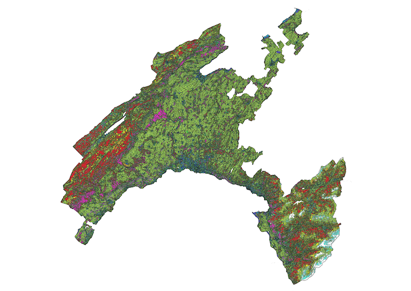{width="33%"}
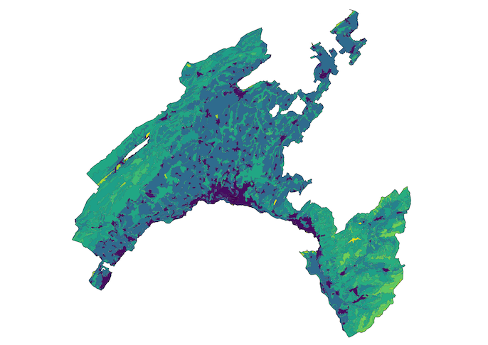{width="33%"}
{width="33%"}  
  
Here is a random area within Vaud showing the differences. The grid is 1km x 1km, with the public inventory tubes shown as the small black points (with 5m and 10m buffers), and building footprints from open street maps. (OpFo, CORINE, VD).  
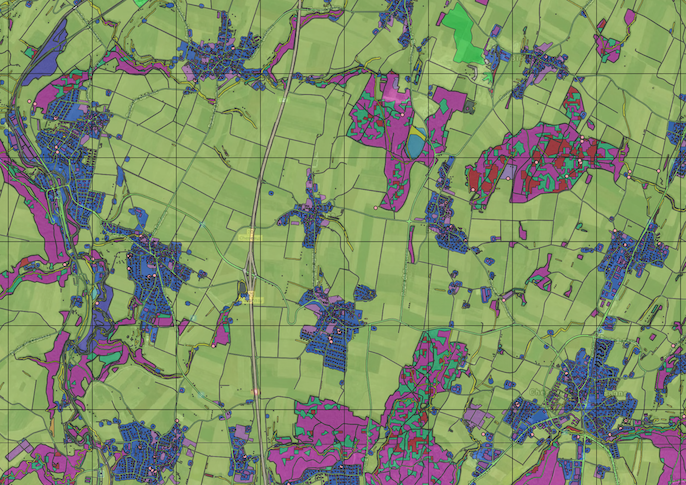{width="33%"}
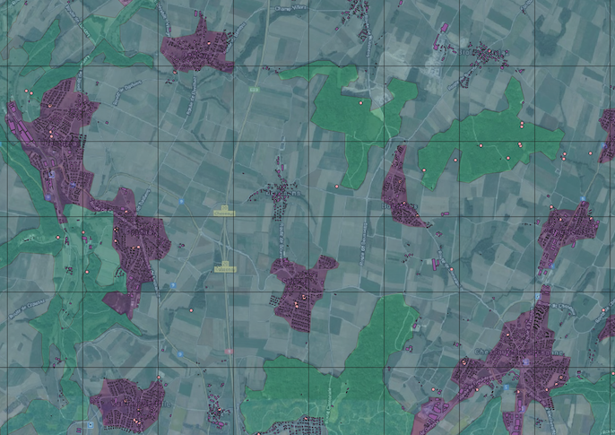{width="33%"}
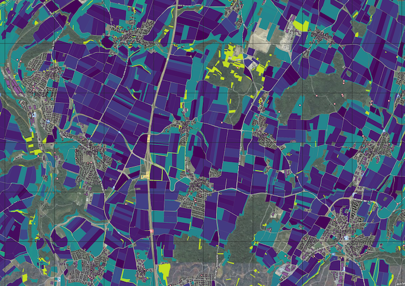{width="33%"}

Zoomed in on the edge of a town (OpFo, CORINE, VD):  
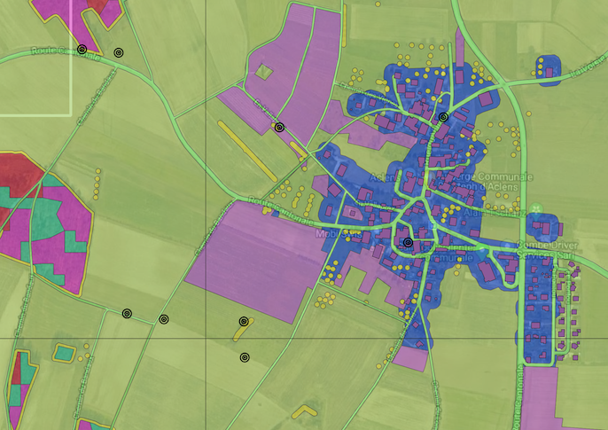{width="33%"}
{width="33%"}
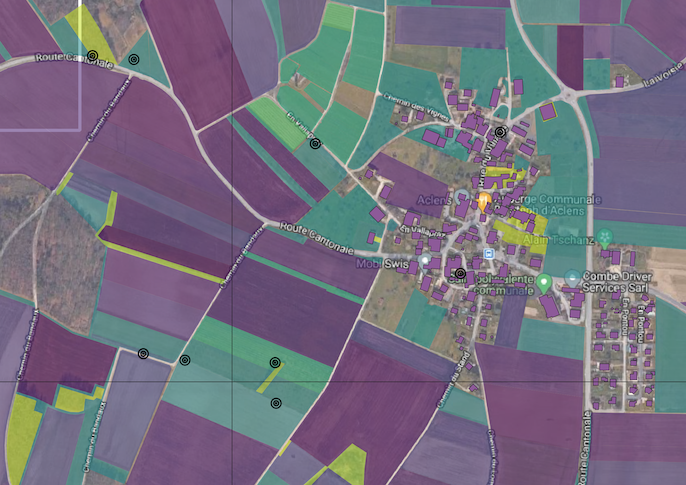{width="33%"}

Zoomed in close on a couple of points (OpFo, CORINE, VD):  
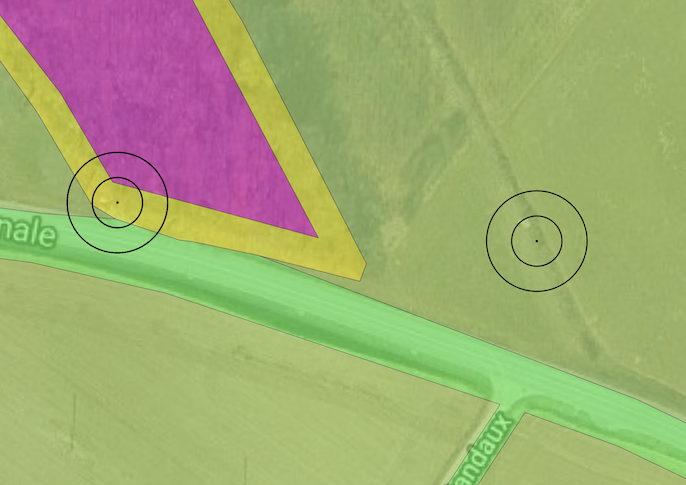{width="33%"}
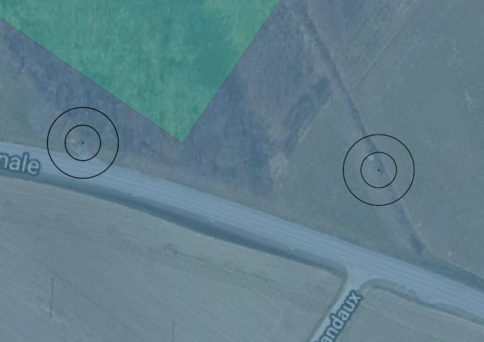{width="33%"}
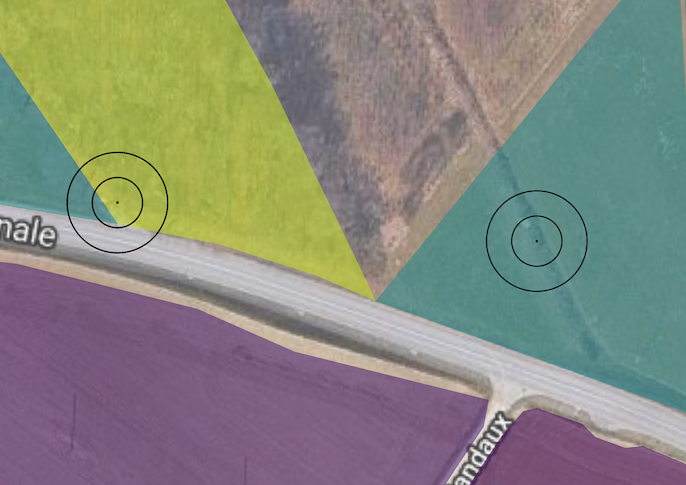{width="33%"}  


### CORINE  

CORINE is often used in the literature, but it is less instinctively appealing since we have access to datasets that are more thematically and spatially accurate/precise with the extent is limited to Vaud. On the other hand, using a less precise dataset like CORINE would be more forgiving of sample location error. CORINE could also potentially be useful for defining broadly whether samples were in cities/towns since the legend includes [*Continuous/Discontinuous urban fabric*](https://image.discomap.eea.europa.eu/arcgis/rest/services/Corine/CLC2018_WM/MapServer/legend) (in center column above, purple = discontinuous urban fabric). For the other datasets, the main concern is whether the point locations are reliably precise enough to align them with the layer polygons.  
```{r CORINE_legend_1, echo=F, message=F, warning=F}
read_csv(paste0(gis_dir, "corine_legend.csv")) %>% 
  filter(CODE_18 %in% unique(corine$CODE_18)) %>%
  select(Original) %>% rename(Category=Original)
```


### Vaud land use  

The land use data from the canton describes the reported usage in 2019, generally for open canopy habitats. The usage is quite detailed, with a focus on agriculture. Organic vs. conventional methods are not included. It uses 3-digit codes where the first digit indicates (roughly) *500: crops*, *600: pastures*, *700: permanent agriculture*, *800: other?*, and *900: other?*. This table shows the categories with corresponding area and percent of the total.  
```{r VD_data, echo=FALSE, message=FALSE}
open_use %>% rename(Category=affectatio) %>% st_set_geometry(NULL) %>%
  group_by(Category) %>% 
  summarise(Area=round(units::set_units(sum(area), "km2"),2)) %>%
  ungroup %>% mutate(Percent=round(as.numeric(Area/sum(Area))*100, 1)) %>% 
  arrange(Category)
```


## Habitat: Points & buffers  
Using the same habitat categories as the structured samples (first column of plots above), we can calculate the habitat for each tube as the point location, the dominant habitat within 5m, and the dominant habitat within 10m.
```{r habitat_calc, eval=FALSE, message=FALSE, warning=FALSE, include=FALSE}
if(any(!st_is_valid(lc))) lc <- st_make_valid(lc)

lc_pt.join <- st_join(pub_filt %>% select(TubeNo), 
                      lc %>% select(Categorie)) %>% 
  group_by(TubeNo) %>% slice_head(n=1)
lc_5m.intsct <- st_intersection(pub.5m %>% select(TubeNo), 
                                lc %>% select(Categorie)) %>% 
  mutate(area=st_area(.)) %>% group_by(TubeNo) %>%
  mutate(prop=as.numeric(area/sum(area)))
lc_10m.intsct <- st_intersection(pub.10m %>% select(TubeNo), 
                                 lc %>% select(Categorie)) %>% 
  mutate(area=st_area(.)) %>% group_by(TubeNo) %>%
  mutate(prop=as.numeric(area/sum(area)))
st_write(lc_pt.join, paste0(gis_dir, "opfo_public_lc_pts.shp"))
st_write(st_collection_extract(lc_5m.intsct %>% ungroup, "POLYGON"), 
         paste0(gis_dir, "opfo_public_lc_5m.shp"))
st_write(st_collection_extract(lc_10m.intsct %>% ungroup, "POLYGON"), 
         paste0(gis_dir, "opfo_public_lc_10m.shp"))
```
```{r habitat_load, echo=F, results='hide', message=F, warning=F}
# Run above operations one time only because of processing time
lc_pt.join <- st_read(paste0(gis_dir, "opfo_public_lc_pts.shp"))
lc_5m.intsct <- st_read(paste0(gis_dir, "opfo_public_lc_5m.shp"))
lc_10m.intsct<- st_read(paste0(gis_dir, "opfo_public_lc_10m.shp"))
corine_pt.join <- st_join(pub_filt %>% select(TubeNo), 
                      corine %>% select(CODE_18))
corine_5m.intsct <- intersect_with_composition(pub.5m, corine, "CODE_18")
corine_10m.intsct <- intersect_with_composition(pub.10m, corine, "CODE_18")
open_use_pt.join <- st_join(pub_filt %>% select(TubeNo), 
                          open_use %>% select(affectatio))
open_use_5m.intsct <- intersect_with_composition(pub.5m, open_use, "affectatio")
open_use_10m.intsct <- intersect_with_composition(pub.10m, open_use, "affectatio")

```

We can assign the habitat type for each tube as either the habitat at the point location, ignoring uncertainty, or the dominant habitat within the 5m or 10m buffer. Larger buffers will obviously include more habitat categories, and samples collected along roads or edges would most likely be mis-categorized since those habitat types are unlikely to have the greatest coverage within a 5m or 10m radius. Conversely, even slight inaccuracies in the coordinates would result in mis-categorization of these samples based on the point locations. Assigning a habitat to each point with any degree of confidence is not trivial. 
```{r habitat_buffers, echo=FALSE, message=FALSE, warning=FALSE}
lc.df <- pub_filt %>%
  # Opfo habitats: categorization, max proportional cover, number of types
  full_join(., lc_pt.join %>% st_set_geometry(NULL) %>% 
              rename(cat_opfo.pt=Categorie), 
            by="TubeNo") %>%
  full_join(., categorize_buffers(lc_5m.intsct, "Categorie", "opfo.5m"),
            by="TubeNo") %>%
  full_join(., categorize_buffers(lc_10m.intsct, "Categorie", "opfo.10m"),
            by="TubeNo") %>%
  # CORINE habitats: categorization, max proportional cover, number of types
  full_join(., corine_pt.join %>% st_set_geometry(NULL) %>% 
              rename(cat_corine.pt=CODE_18), 
            by="TubeNo") %>%
  full_join(., categorize_buffers(corine_5m.intsct, "CODE_18", "corine.5m"),
            by="TubeNo") %>%
  full_join(., categorize_buffers(corine_10m.intsct, "CODE_18", "corine.10m"),
            by="TubeNo") %>%
  # Land uses: categorization, max proportional cover, number of types
  full_join(., open_use_pt.join %>% st_set_geometry(NULL) %>% 
              rename(cat_open_use.pt=affectatio), 
            by="TubeNo") %>%
  full_join(., categorize_buffers(open_use_5m.intsct, "affectatio", "open_use.5m"),
            by="TubeNo") %>%
  full_join(., categorize_buffers(open_use_10m.intsct, "affectatio", "open_use.10m"),
            by="TubeNo") %>%
  mutate(across(starts_with("cat_"), as.character))
```
```{r habitat_buffers_plots, echo=FALSE, message=FALSE, warning=FALSE}
lc.df %>% st_set_geometry(NULL) %>% 
  select(TubeNo, starts_with("cat_")) %>% 
  pivot_longer(starts_with("cat_"), names_to="Est", values_to="Cat") %>%
  mutate(Dataset=str_split_fixed(str_sub(Est, 5, -1), "\\.", 2)[,1], 
         Buffer=str_split_fixed(Est, "\\.", 2)[,2]) %>% select(-Est) %>%
  pivot_wider(names_from="Buffer", values_from="Cat") %>% 
  mutate('Point vs. 5m'=pt==`5m`,
         'Point vs. 10m'=pt==`10m`,
         '5m vs. 10m'=`5m`==`10m`) %>%
  select(Dataset, contains("vs.")) %>% 
  pivot_longer(2:4, names_to="Comparison", values_to="Matching") %>%
  mutate(Dataset=factor(Dataset, levels=c("opfo", "corine", "open_use"),
                        labels=c("OpFo", "CORINE", "VD Landuse"))) %>%
  filter(!is.na(Matching)) %>%
  ggplot(aes(Comparison, fill=Matching)) + facet_grid(.~Dataset) +
  geom_hline(yintercept=0, size=0.3, colour="grey30") +
  geom_bar(colour="grey30", size=0.3, position="fill") + 
  scale_y_continuous(labels=scales::percent_format()) + 
  scale_fill_manual(values=c("gray", "#006d2c")) +
  labs(x="", y="Percent of tubes",
       title="\nBuffers show most difference with points in OpFo (~11%)") +
  theme(axis.text.x=element_text(angle=270, hjust=0, vjust=0.5),
        legend.position="bottom")
lc.df %>% st_set_geometry(NULL) %>% 
  select(starts_with("n_")) %>% 
  pivot_longer(everything(), names_to="Est", values_to="N") %>%
  filter(!is.na(N)) %>%
  mutate(Dataset=str_split_fixed(str_sub(Est, 3, -1), "\\.", 2)[,1], 
         Buffer=str_split_fixed(Est, "\\.", 2)[,2]) %>% select(-Est) %>%
  mutate(Dataset=factor(Dataset, levels=c("opfo", "corine", "open_use"),
                        labels=c("OpFo", "CORINE", "VD Landuse"))) %>%
  group_by(Dataset, Buffer, N) %>% summarise(tubes=n()) %>%
  group_by(Dataset, Buffer) %>% mutate(prop=tubes/sum(tubes)) %>%
  ggplot(aes(as.character(N), y=prop, fill=Buffer)) + facet_grid(.~Dataset) +
  geom_hline(yintercept=0, size=0.3, colour="grey30") +
  geom_bar(position="dodge", stat="identity", colour="grey30", size=0.3) +
  scale_y_continuous(labels=scales::percent_format()) + 
  scale_fill_manual(values=buffer_col) +
  labs(x="Number of habitats", y="Percent of tubes", 
       title="\nMost OpFo buffers include multiple habitats") +
  theme(legend.position="bottom")
lc.df %>% st_set_geometry(NULL) %>%
  select(starts_with("prLargest_")) %>% 
  pivot_longer(everything(), names_to="Est", values_to="prLargest") %>%
  filter(!is.na(prLargest)) %>%
  mutate(Dataset=str_split_fixed(str_sub(Est, 11, -1), "\\.", 2)[,1], 
         Buffer=str_split_fixed(Est, "\\.", 2)[,2]) %>% select(-Est) %>%
  mutate(Dataset=factor(Dataset, levels=c("opfo", "corine", "open_use"),
                        labels=c("OpFo", "CORINE", "VD Landuse"))) %>%
  ggplot(aes(prLargest, fill=Buffer)) + 
  facet_wrap(~Dataset, nrow=1, scales="free_y") + 
  geom_hline(yintercept=0, size=0.3, colour="grey30") +
  geom_density(size=0.3, alpha=0.7, colour="grey30") +
  scale_x_continuous(labels=scales::percent_format(), limits=c(0,1)) + 
  scale_fill_manual(values=buffer_col) +
  labs(x="Percent coverage of dominant category", y="Density",
       title="\nCoverage of the dominant category within the buffer") +
  theme(legend.position="bottom")
```


## `HABITAT`: Cross-reference {.tabset .tabeset-fade}  

### `HABITAT` entries  
The public samples included a field for habitat, and `r sum(!is.na(pub_filt$HABITAT))` tubes (`r paste0(round(sum(!is.na(pub_filt$HABITAT))/nrow(pub_filt)*100, 1), "%")`) include a free-form entry. However, these were not standardized, and there were `r n_distinct(pub_filt$HABITAT, na.rm=T)` unique responses. They range from extremely precise about where the ant was captured to rather general. Some seem to describe the diameter of the tree where the ant was collected.  
```{r habitat_entries, echo=FALSE}
tabyl(str_sub(lc.df$HABITAT, 1, 60)) %>% select(1,2) %>% 
  setNames(c("HABITAT entries", "count")) %>% as_tibble
```

Many of the habitats used for the OpFo structured samples are unlikely to have direct matches that would allow for unambiguous categorization. Searches for keywords could give an idea of how well the extracted habitat matches the stated habitat for the (mostly) unambiguous keywords.


### Forest  
Forests are generally large habitat polygons, and most `HABITAT` descriptions including the word *forêt* should be describing tubes collected in forest habitat. Edges, borders, and clearings can be filtered out to look at a sort of 'best case' scenario.
```{r habitat_entries_forest, echo=F, warning=F, message=F}
# Forest is maybe most straightforward, but it will also include edges and clearings
cat("Descriptions with 'for*t':", sum(grepl('[f,F]or.t', lc.df$HABITAT)))
tabyl(grep('[f,F]or.t', lc.df$HABITAT, value=T)) %>% select(1,2) %>% 
  setNames(c("HABITAT with for*t", "count")) %>% as_tibble %>%
  mutate(`HABITAT with for*t`=str_sub(`HABITAT with for*t`, 1, 60))

# HABITAT including for*t but excluding lisi*re, bord*, and clairi*re
HABITAT_foret <- grep('[f,F]or.t', unique(lc.df$HABITAT), value=T) %>%
  grep('lisi.re', ., value=T, invert=T) %>%
  grep('bord', ., value=T, invert=T) %>%
  grep('clari*re', ., value=T, invert=T)
# Forest habitat categorizations
foret.df <- full_join(filter(lc.df, HABITAT %in% HABITAT_foret) %>% 
                        st_set_geometry(NULL) %>%
                        tabyl(cat_opfo.pt) %>% adorn_pct_formatting() %>%
                        select(cat_opfo.pt, n, percent) %>% 
                        rename(Categorie=cat_opfo.pt, n_pt=n, pct_pt=percent),
                      filter(lc.df, HABITAT %in% HABITAT_foret) %>% 
                        st_set_geometry(NULL) %>%
                        tabyl(cat_opfo.5m) %>% adorn_pct_formatting() %>%
                        select(cat_opfo.5m, n, percent) %>% 
                        rename(Categorie=cat_opfo.5m, n_5m=n, pct_5m=percent),
                      by="Categorie") %>%
  full_join(., 
            filter(lc.df, HABITAT %in% HABITAT_foret) %>% 
              st_set_geometry(NULL) %>%
              tabyl(cat_opfo.10m) %>% adorn_pct_formatting() %>%
              select(cat_opfo.10m, n, percent) %>% 
              rename(Categorie=cat_opfo.10m, n_10m=n, pct_10m=percent), 
            by="Categorie") %>%
  select(Categorie, contains("n_"), contains("pct_"))
foret.df %>% select(Categorie, contains("n_")) %>% 
  rename(Point=n_pt, `5m`=n_5m, `10m`=n_10m) %>%
  adorn_percentages(denominator="col") %>%
  pivot_longer(2:4, names_to="Buffer", values_to="Prop") %>%
  ggplot(aes(Categorie, Prop, fill=Buffer)) + 
  geom_bar(position="dodge", stat="identity", colour="grey30", size=0.3) +
  scale_y_continuous(labels=scales::percent_format()) + 
  scale_fill_manual(values=buffer_col) +
  labs(x="", y="Percent", 
       title="Forest categorization works best with 10m buffer",
       subtitle="But 30.7% of 'forest' tubes are not forest by 10m location") +
  theme(axis.text.x=element_text(angle=270, hjust=0, vjust=0.5))
knitr::kable(foret.df, 
             caption="Habitat extractions for tubes with HABITAT reported as forest.")
```

The high proportion of point locations and 5m buffers classified as `transport` could reflect that the ants were collected along a road in the forest, or that the coordinates were recorded after returning to the car.


### Lisière  
The *a priori* expectation is that the point locations should be somewhat better for narrow habitat types like `lisière`. I would also expect poor performance across all methods, since inaccuracy in the point location is likely to move the point outside the habitat polygon, and buffers will include more non-target habitat types.  
```{r habitat_entries_lisiere, echo=F, warning=F, message=F}
cat("Descriptions with 'lisi.re':", sum(grepl('lisi.re', lc.df$HABITAT)))
tabyl(grep('lisi.re', lc.df$HABITAT, value=T)) %>% select(1,2) %>% 
  setNames(c("Edge HABITAT", "count")) %>% as_tibble %>%
  mutate(`Edge HABITAT`=str_sub(`Edge HABITAT`, 1, 60))

# HABITAT including lisi*re or bord*
HABITAT_edge <- unique(grep('lisi.re', unique(lc.df$HABITAT), value=T))
# Edge habitat categorizations
edge.df <- full_join(filter(lc.df, HABITAT %in% HABITAT_edge) %>% 
                        st_set_geometry(NULL) %>%
                        tabyl(cat_opfo.pt) %>% adorn_pct_formatting() %>%
                        select(cat_opfo.pt, n, percent) %>% 
                        rename(Categorie=cat_opfo.pt, n_pt=n, pct_pt=percent),
                      filter(lc.df, HABITAT %in% HABITAT_edge) %>% 
                        st_set_geometry(NULL) %>%
                        tabyl(cat_opfo.5m) %>% adorn_pct_formatting() %>%
                        select(cat_opfo.5m, n, percent) %>% 
                        rename(Categorie=cat_opfo.5m, n_5m=n, pct_5m=percent),
                      by="Categorie") %>%
  full_join(., 
            filter(lc.df, HABITAT %in% HABITAT_edge) %>% 
              st_set_geometry(NULL) %>%
              tabyl(cat_opfo.10m) %>% adorn_pct_formatting() %>%
              select(cat_opfo.10m, n, percent) %>% 
              rename(Categorie=cat_opfo.10m, n_10m=n, pct_10m=percent), 
            by="Categorie") %>%
  select(Categorie, contains("n_"), contains("pct_"))
edge.df %>% select(Categorie, contains("n_")) %>% 
  rename(Point=n_pt, `5m`=n_5m, `10m`=n_10m) %>%
  adorn_percentages(denominator="col") %>%
  pivot_longer(2:4, names_to="Buffer", values_to="Prop") %>%
  ggplot(aes(Categorie, Prop, fill=Buffer)) + 
  geom_bar(position="dodge", stat="identity", colour="grey30", size=0.3) +
  scale_y_continuous(labels=scales::percent_format()) + 
  scale_fill_manual(values=buffer_col) +
  labs(x="", y="Percent", 
       title="Few 'edge' tubes are lisière based on location") +
  theme(axis.text.x=element_text(angle=270, hjust=0, vjust=0.5))
knitr::kable(edge.df, 
             caption="Habitat extractions for tubes with HABITAT reported as lisière")
```

The point locations and 5m buffer capture `lisière` about equally, but it is still only 17% of the tubes with *lisi.re* in the `HABITAT` description. 


### Roads  
Like for `lisière`, the *a priori* expectation is that the point locations should be better for `transport`, but with relatively poor performance across all methods. There are many descriptions in `HABITAT` that use the word *chemin*, but that's probably used more often for trails rather than actual roads.  
```{r habitat_entries_transport, echo=F, warning=F, message=F}
cat("Descriptions with 'rue' or 'route':", 
    sum(grepl('rue($| )|route', lc.df$HABITAT)))
tabyl(grep('rue($| )|route', lc.df$HABITAT, value=T)) %>% select(1,2) %>% 
  setNames(c("Road HABITAT", "count")) %>% as_tibble %>%
  mutate(`Road HABITAT`=str_sub(`Road HABITAT`, 1, 60))

# HABITAT including rue or route
HABITAT_road <- unique(grep('rue($| )|route', unique(lc.df$HABITAT), value=T))
# Edge habitat categorizations
road.df <- full_join(filter(lc.df, HABITAT %in% HABITAT_road) %>% 
                        st_set_geometry(NULL) %>%
                        tabyl(cat_opfo.pt) %>% adorn_pct_formatting() %>%
                        select(cat_opfo.pt, n, percent) %>% 
                        rename(Categorie=cat_opfo.pt, n_pt=n, pct_pt=percent),
                      filter(lc.df, HABITAT %in% HABITAT_road) %>% 
                        st_set_geometry(NULL) %>%
                        tabyl(cat_opfo.5m) %>% adorn_pct_formatting() %>%
                        select(cat_opfo.5m, n, percent) %>% 
                        rename(Categorie=cat_opfo.5m, n_5m=n, pct_5m=percent),
                      by="Categorie") %>%
  full_join(., 
            filter(lc.df, HABITAT %in% HABITAT_road) %>% 
              st_set_geometry(NULL) %>%
              tabyl(cat_opfo.10m) %>% adorn_pct_formatting() %>%
              select(cat_opfo.10m, n, percent) %>% 
              rename(Categorie=cat_opfo.10m, n_10m=n, pct_10m=percent), 
            by="Categorie") %>%
  select(Categorie, contains("n_"), contains("pct_"))
road.df %>% select(Categorie, contains("n_")) %>% 
  rename(Point=n_pt, `5m`=n_5m, `10m`=n_10m) %>%
  adorn_percentages(denominator="col") %>%
  pivot_longer(2:4, names_to="Buffer", values_to="Prop") %>%
  ggplot(aes(Categorie, Prop, fill=Buffer)) + 
  geom_bar(position="dodge", stat="identity", colour="grey30", size=0.3) +
  scale_y_continuous(labels=scales::percent_format()) + 
  scale_fill_manual(values=buffer_col) +
  labs(x="", y="Percent", 
       title="36.2% of 'road' tubes are transport based on 5m buffer") +
  theme(axis.text.x=element_text(angle=270, hjust=0, vjust=0.5))
knitr::kable(road.df, 
             caption="Habitat extractions for tubes with HABITAT reported as transport")
```

More tubes with `HABITAT` descriptions including *rue* and *route* are classified as `transport` than any other category based on 5m locations, but it is still only about a third. Surprisingly, there is not much difference between the point locations and the buffers.  


### Zone Construite  
The `ZoneConstruite` category should also be unambiguous. 
```{r habitat_entries_ZC, echo=F, warning=F, message=F}
# This should be as good of a match as is possible
ZC_keywords <- paste("maison", "appartement", "étage", "balcon", "cuisine", sep="|")
cat("ZC keywords:", ZC_keywords, "\n")
cat("Descriptions with keywords:", sum(grepl(ZC_keywords, lc.df$HABITAT)))
tabyl(grep(ZC_keywords, lc.df$HABITAT, value=T)) %>% select(1,2) %>% 
  setNames(c("ZC HABITAT", "count")) %>% as_tibble %>%
  mutate(`ZC HABITAT`=str_sub(`ZC HABITAT`, 1, 60))

# HABITAT including ZC keywords
HABITAT_ZC <- unique(grep(ZC_keywords, unique(lc.df$HABITAT), value=T))
# ZC habitat categorizations
ZC.df <- full_join(filter(lc.df, HABITAT %in% HABITAT_ZC) %>% 
                        st_set_geometry(NULL) %>%
                        tabyl(cat_opfo.pt) %>% adorn_pct_formatting() %>%
                        select(cat_opfo.pt, n, percent) %>% 
                        rename(Categorie=cat_opfo.pt, n_pt=n, pct_pt=percent),
                      filter(lc.df, HABITAT %in% HABITAT_ZC) %>% 
                        st_set_geometry(NULL) %>%
                        tabyl(cat_opfo.5m) %>% adorn_pct_formatting() %>%
                        select(cat_opfo.5m, n, percent) %>% 
                        rename(Categorie=cat_opfo.5m, n_5m=n, pct_5m=percent),
                      by="Categorie") %>%
  full_join(., 
            filter(lc.df, HABITAT %in% HABITAT_ZC) %>% 
              st_set_geometry(NULL) %>%
              tabyl(cat_opfo.10m) %>% adorn_pct_formatting() %>%
              select(cat_opfo.10m, n, percent) %>% 
              rename(Categorie=cat_opfo.10m, n_10m=n, pct_10m=percent), 
            by="Categorie") %>%
  select(Categorie, contains("n_"), contains("pct_"))
ZC.df %>% select(Categorie, contains("n_")) %>% 
  rename(Point=n_pt, `5m`=n_5m, `10m`=n_10m) %>%
  adorn_percentages(denominator="col") %>%
  pivot_longer(2:4, names_to="Buffer", values_to="Prop") %>%
  ggplot(aes(Categorie, Prop, fill=Buffer)) + 
  geom_bar(position="dodge", stat="identity", colour="grey30", size=0.3) +
  scale_y_continuous(labels=scales::percent_format()) + 
  scale_fill_manual(values=buffer_col) +
  labs(x="", y="Percent", 
       title="80% of 'ZC' tubes are ZC based on location") +
  theme(axis.text.x=element_text(angle=270, hjust=0, vjust=0.5))
knitr::kable(ZC.df, 
             caption="Habitat extractions for tubes with HABITAT entries containing a ZC keyword")
```

Generally good correspondence, with minimal differences among buffers. 


### Pastures  
Samples collected in pastures should be classified pretty reliably as `Autre` or `PrairieSeche`. The table and figure exclude `HABITAT` descriptions that contain `lisi*re`.  
```{r habitat_entries_pasture, echo=F, warning=F, message=F}
cat("Descriptions with p*turage:", sum(grepl('p.turage', lc.df$HABITAT)))
tabyl(grep('p.turage', lc.df$HABITAT, value=T)) %>% select(1,2) %>% 
  setNames(c("Pasture HABITAT", "count")) %>% as_tibble %>%
  mutate(`Pasture HABITAT`=str_sub(`Pasture HABITAT`, 1, 60))


# HABITAT including p*turage
HABITAT_paturage <- unique(grep('p.turage', unique(lc.df$HABITAT), value=T) )%>%
  grep('lisi.re', ., value=T, invert=T)
landuse_paturage <- grep("[p,P].turage", unique(open_use$affectatio), value=T)

lc.df <- lc.df %>% mutate(HAB_paturage=HABITAT %in% HABITAT_paturage,
                          use_paturage.pt=cat_open_use.pt %in% landuse_paturage,
                          use_paturage.5m=cat_open_use.5m %in% landuse_paturage,
                          use_paturage.10m=cat_open_use.10m %in% landuse_paturage)
# Pasture habitat categorizations
pasture.df <- full_join(filter(lc.df, HABITAT %in% HABITAT_paturage) %>% 
                        st_set_geometry(NULL) %>%
                        tabyl(cat_opfo.pt) %>% adorn_pct_formatting() %>%
                        select(cat_opfo.pt, n, percent) %>% 
                        rename(Categorie=cat_opfo.pt, n_pt=n, pct_pt=percent),
                      filter(lc.df, HABITAT %in% HABITAT_paturage) %>% 
                        st_set_geometry(NULL) %>%
                        tabyl(cat_opfo.5m) %>% adorn_pct_formatting() %>%
                        select(cat_opfo.5m, n, percent) %>% 
                        rename(Categorie=cat_opfo.5m, n_5m=n, pct_5m=percent),
                      by="Categorie") %>%
  full_join(., 
            filter(lc.df, HABITAT %in% HABITAT_paturage) %>% 
              st_set_geometry(NULL) %>%
              tabyl(cat_opfo.10m) %>% adorn_pct_formatting() %>%
              select(cat_opfo.10m, n, percent) %>% 
              rename(Categorie=cat_opfo.10m, n_10m=n, pct_10m=percent), 
            by="Categorie") %>%
  select(Categorie, contains("n_"), contains("pct_"))
pasture.df %>% select(Categorie, contains("n_")) %>% 
  rename(Point=n_pt, `5m`=n_5m, `10m`=n_10m) %>%
  adorn_percentages(denominator="col") %>%
  pivot_longer(2:4, names_to="Buffer", values_to="Prop") %>%
  ggplot(aes(Categorie, Prop, fill=Buffer)) + 
  geom_bar(position="dodge", stat="identity", colour="grey30", size=0.3) +
  scale_y_continuous(labels=scales::percent_format()) + 
  scale_fill_manual(values=buffer_col) +
  labs(x="", y="Percent", 
       title="70-77% of 'pasture' tubes are Autre or Prairie Sèche ") +
  theme(axis.text.x=element_text(angle=270, hjust=0, vjust=0.5))
knitr::kable(pasture.df, 
             caption="Habitat extractions for tubes with HABITAT entries containing p*turage")
```

Tubes collected in pastures based on `HABITAT` description are distributed across only 6 types of extracted land cover, with most aligning with `Autre`. Sizable numbers mapped to `lisière` or `transport`, despite removing descriptions containing the word `lisi*re`.  


----------


# Gardens & urban areas  
## `HABITAT` & OpFo habitats  
Some of the `HABITAT` descriptions specify that they were collected in gardens. My expectation is that these tubes should almost entirely categorized as `ZoneConstruite`, `Autre`, and `CulturePerm`. 
```{r habitat_entries_garden, echo=F, warning=F, message=F}
jardin_keywords <- paste("jardin", "potag", sep="|")
cat("Descriptions with 'jardin' or 'potag*':", 
    sum(grepl(jardin_keywords, lc.df$HABITAT)))
tabyl(grep(jardin_keywords, lc.df$HABITAT, value=T)) %>% select(1,2) %>% 
  setNames(c("jardin HABITAT", "count")) %>% as_tibble %>%
  mutate(`jardin HABITAT`=str_sub(`jardin HABITAT`, 1, 60))

# HABITAT including jardin keywords
HABITAT_jardin <- unique(grep(jardin_keywords, unique(lc.df$HABITAT), value=T))
# jardin habitat categorizations
jardin.df <- full_join(filter(lc.df, HABITAT %in% HABITAT_jardin) %>% 
                        st_set_geometry(NULL) %>%
                        tabyl(cat_opfo.pt) %>% adorn_pct_formatting() %>%
                        select(cat_opfo.pt, n, percent) %>% 
                        rename(Categorie=cat_opfo.pt, n_pt=n, pct_pt=percent),
                      filter(lc.df, HABITAT %in% HABITAT_jardin) %>% 
                        st_set_geometry(NULL) %>%
                        tabyl(cat_opfo.5m) %>% adorn_pct_formatting() %>%
                        select(cat_opfo.5m, n, percent) %>% 
                        rename(Categorie=cat_opfo.5m, n_5m=n, pct_5m=percent),
                      by="Categorie") %>%
  full_join(., 
            filter(lc.df, HABITAT %in% HABITAT_jardin) %>% 
              st_set_geometry(NULL) %>%
              tabyl(cat_opfo.10m) %>% adorn_pct_formatting() %>%
              select(cat_opfo.10m, n, percent) %>% 
              rename(Categorie=cat_opfo.10m, n_10m=n, pct_10m=percent), 
            by="Categorie") %>%
  select(Categorie, contains("n_"), contains("pct_"))
jardin.df %>% select(Categorie, contains("n_")) %>% 
  rename(Point=n_pt, `5m`=n_5m, `10m`=n_10m) %>%
  adorn_percentages(denominator="col") %>%
  pivot_longer(2:4, names_to="Buffer", values_to="Prop") %>%
  ggplot(aes(Categorie, Prop, fill=Buffer)) + 
  geom_bar(position="dodge", stat="identity", colour="grey30", size=0.3) +
  scale_y_continuous(labels=scales::percent_format()) + 
  scale_fill_manual(values=buffer_col) +
  labs(x="", y="Percent", 
       title="82-88% of 'jardin' tubes are ZC/Autre/CP based on location") +
  theme(axis.text.x=element_text(angle=270, hjust=0, vjust=0.5))
knitr::kable(jardin.df, 
             caption="Habitat extractions for tubes with HABITAT entries containing a jardin keyword")
```

The buffers both place about 95% of the tubes in `ZoneConstruite`, `Autre`, or `CulturePerm`, compared with 83% of the point locations, which include a higher percentage of `transport`.


## Gardens & CORINE urban areas  
As a first approximation, we could classify points as inside or outside urban areas using the CORINE land cover categories ([1XX indicate human-dominated types](https://image.discomap.eea.europa.eu/arcgis/rest/services/Corine/CLC2018_WM/MapServer/legend)). To categorize tubes as coming from gardens, there are two options: 1) use the `HABITAT` descriptions as above, including all tubes with *jardin* or *potage* in the description, or 2) using the *`r grep("jardin|potag", unique(open_use$affectatio), value=T)`* category in the Vaud land use dataset. Unfortunately, there are no tubes that are categorized as *`r grep("jardin|potag", unique(open_use$affectatio), value=T)`* based on location, regardless of buffering. 


There are too few tubes with CORINE classifications of *111 Continuous urban fabric*, which identifies parts of the few largest cities in Vaud. The *112 Discontinuous urban fabric* identifies most (but not all) towns, so the comparison of gardens between cities vs. non-cities would need to be between urban and non-urban categories.  
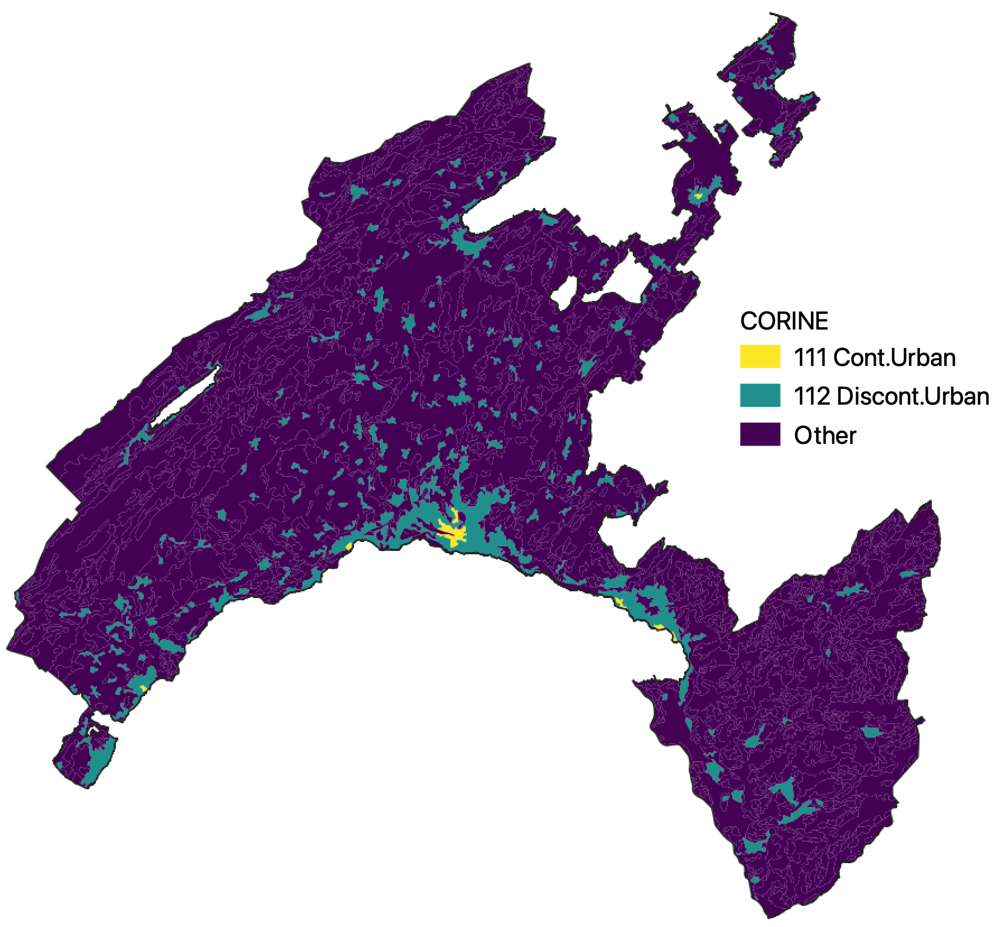{width="70%"}

```{r corine_urban, echo=FALSE}
jardin_keywords <- paste("jardin", "potag", sep="|")
HABITAT_jardin <- unique(grep(jardin_keywords, unique(lc.df$HABITAT), value=T))
landuse_jardin <- grep(jardin_keywords, unique(open_use$affectatio), value=T)

lc.df <- lc.df %>% mutate(HAB_jardin=HABITAT %in% HABITAT_jardin,
                          use_jardin.pt=cat_open_use.pt %in% landuse_jardin,
                          use_jardin.5m=cat_open_use.5m %in% landuse_jardin,
                          use_jardin.10m=cat_open_use.10m %in% landuse_jardin,
                          corine_urban.pt=grepl("^1", cat_corine.pt),
                          corine_urban.5m=grepl("^1", cat_corine.5m),
                          corine_urban.10m=grepl("^1", cat_corine.10m),
                          corine_urbanCont.pt=grepl("111", cat_corine.pt),
                          corine_urbanCont.5m=grepl("111", cat_corine.5m),
                          corine_urbanCont.10m=grepl("111", cat_corine.10m))

# jardin HABITAT descriptions by corine category
lc.df %>% st_set_geometry(NULL) %>% tabyl(HAB_jardin, corine_urban.5m) %>%
  knitr::kable(col.names=c("Garden", "Non-Urban", "Urban"), 
               caption="Corine: 5m (point and 10m buffer are identical)")
```


## Population & density  

Another possibility would be to categorize communes based on population (that's the smallest unit I've found).   
```{r map_population, echo=FALSE}
A <- ggplot(VD_raw, aes(fill=pop)) + geom_sf(size=0.1) +
  ggtitle("2019 Population") +
  scale_fill_viridis_c("") +
  theme(axis.text=element_blank(),
        legend.position=c(0.35, 0.1), 
        legend.background=element_blank(),
        legend.direction="horizontal", 
        legend.key.height=unit(0.2, "cm"),
        legend.key.width=unit(0.35, "cm"),
        legend.text=element_text(size=5),
        title=element_text(size=7))
B <- ggplot(VD_raw, aes(fill=log(pop))) + geom_sf(size=0.1) +
  ggtitle("2019 Population (log)") +
  scale_fill_viridis_c("") +
  theme(axis.text=element_blank(),
        legend.position=c(0.35, 0.1), 
        legend.background=element_blank(),
        legend.direction="horizontal", 
        legend.key.height=unit(0.2, "cm"),
        legend.key.width=unit(0.35, "cm"),
        legend.text=element_text(size=5),
        title=element_text(size=7))
C <- ggplot(VD_raw, aes(fill=as.numeric(popDens))) + geom_sf(size=0.1) +
  ggtitle("2019 Population Density (pop/km2)") +
  scale_fill_viridis_c("") +
  theme(axis.text=element_blank(),
        legend.position=c(0.35, 0.1), 
        legend.background=element_blank(),
        legend.direction="horizontal", 
        legend.key.height=unit(0.2, "cm"),
        legend.key.width=unit(0.35, "cm"),
        legend.text=element_text(size=5),
        title=element_text(size=7))
ggpubr::ggarrange(A, B, C, nrow=1)
```

For the distribution of population sizes among communes, there isn't much of a clear breakpoint aside from Lausanne. 
```{r hist_population, echo=F}
par(mfrow=c(2,2))
hist(VD_raw$pop, xlab="2019 Population", main="")
hist(log(VD_raw$pop), xlab="2019 Population (log)", main="")
hist(VD_raw$popDens, xlab="2019 density (pop/km2)", main="")
hist(log(as.numeric(VD_raw$popDens)), xlab="2019 log density (log(pop/km2))", main="")
```


----------


# Extracted habitat vs. Vaud {.tabset .tabset-fade}  

## OpFo habitats  
Using the habitat types from the structured samples, the public dataset clearly overrepresents `ZoneConstruite` and underrepresents `Autre`.  
```{r OpFo_props, echo=FALSE, message=FALSE, warning=F}
full_join(lc %>% st_set_geometry(NULL) %>% group_by(Categorie) %>%
            summarise(Area=sum(area)) %>% ungroup %>%
            mutate(Vaud=as.numeric(Area/sum(Area))) %>%
            select(Categorie, Vaud),
          lc.df %>% st_set_geometry(NULL) %>% group_by(cat_opfo.pt) %>%
            summarise(N=n()) %>% ungroup %>%
            rename(Categorie=cat_opfo.pt) %>%
            mutate(Point=N/sum(N)) %>% select(Categorie, Point), 
          by="Categorie") %>%
  full_join(., lc.df %>% st_set_geometry(NULL) %>% group_by(cat_opfo.5m) %>%
            summarise(N=n()) %>% ungroup %>%
            rename(Categorie=cat_opfo.5m) %>%
            mutate(`5m`=N/sum(N)) %>% select(Categorie, `5m`),
            by="Categorie") %>%
  full_join(., lc.df %>% st_set_geometry(NULL) %>% group_by(cat_opfo.10m) %>%
            summarise(N=n()) %>% ungroup %>%
            rename(Categorie=cat_opfo.10m) %>%
            mutate(`10m`=N/sum(N)) %>% select(Categorie, `10m`),
            by="Categorie") %>%
  filter(!is.na(Categorie)) %>%
  pivot_longer(2:5, names_to="Source", values_to="Proportion") %>%
  ggplot(aes(x=Categorie, y=Proportion, fill=Source)) + 
  geom_bar(position="dodge", stat="identity", colour="grey30", size=0.3) +
  scale_y_continuous(labels=scales::percent_format()) + 
  scale_fill_manual(values=buffer_col) +
  labs(x="", y="Percent coverage", title="Opération Fourmis categories") +
  theme(axis.text.x=element_text(angle=270, hjust=0, vjust=0.5))
```

## CORINE  
Similarly with the CORINE dataset, category *112 Discontinuous urban fabric* is very overrepresented, with clear underrepresentation for *211 Non-irrigated arable land* and *312 Coniferous forest*.   
```{r corine_props, echo=FALSE, message=FALSE, warning=F}
full_join(corine %>% st_set_geometry(NULL) %>% group_by(CODE_18) %>%
            summarise(Area=sum(area)) %>% ungroup %>%
            mutate(Vaud=as.numeric(Area/sum(Area))) %>%
            select(CODE_18, Vaud),
          lc.df %>% st_set_geometry(NULL) %>% group_by(cat_corine.pt) %>%
            summarise(N=n()) %>% ungroup %>%
            rename(CODE_18=cat_corine.pt) %>%
            mutate(Point=N/sum(N)) %>% select(CODE_18, Point), 
          by="CODE_18") %>%
  full_join(., lc.df %>% st_set_geometry(NULL) %>% group_by(cat_corine.5m) %>%
            summarise(N=n()) %>% ungroup %>%
            rename(CODE_18=cat_corine.5m) %>%
            mutate(`5m`=N/sum(N)) %>% select(CODE_18, `5m`),
            by="CODE_18") %>%
  full_join(., lc.df %>% st_set_geometry(NULL) %>% group_by(cat_corine.10m) %>%
            summarise(N=n()) %>% ungroup %>%
            rename(CODE_18=cat_corine.10m) %>%
            mutate(`10m`=N/sum(N)) %>% select(CODE_18, `10m`),
            by="CODE_18") %>%
  filter(!is.na(CODE_18)) %>%
  pivot_longer(2:5, names_to="Source", values_to="Proportion") %>%
  ggplot(aes(x=CODE_18, y=Proportion, fill=Source)) + 
  geom_bar(position="dodge", stat="identity", colour="grey30", size=0.3) +
  scale_y_continuous(labels=scales::percent_format()) + 
  scale_fill_manual(values=buffer_col) +
  labs(x="", y="Percent coverage", title="CORINE categories") +
  theme(axis.text.x=element_text(angle=270, hjust=0, vjust=0.5))
```

For reference:  
```{r CORINE_legend_2, echo=F, message=F, warning=F}
read_csv(paste0(gis_dir, "corine_legend.csv")) %>% 
  filter(CODE_18 %in% unique(corine$CODE_18)) %>%
  select(Original) %>% rename(Category=Original)
```


## Land use  
For the land use, many crops are underrepresented, while pastures tend to be overrepresented. This is not really surprising given where people would be expected to go to collect ants.  
```{r landuse_props, echo=FALSE, message=FALSE, warning=F}
full_join(open_use %>% st_set_geometry(NULL) %>% group_by(affectatio) %>%
            summarise(Area=sum(area)) %>% ungroup %>%
            mutate(Vaud=as.numeric(Area/sum(Area))) %>%
            select(affectatio, Vaud),
          lc.df %>% st_set_geometry(NULL) %>% group_by(cat_open_use.pt) %>%
            summarise(N=n()) %>% ungroup %>%
            rename(affectatio=cat_open_use.pt) %>% filter(!is.na(affectatio)) %>%
            mutate(Point=N/sum(N)) %>% select(affectatio, Point), 
          by="affectatio") %>%
  full_join(., lc.df %>% st_set_geometry(NULL) %>% group_by(cat_open_use.5m) %>%
            summarise(N=n()) %>% ungroup %>%
            rename(affectatio=cat_open_use.5m) %>% filter(!is.na(affectatio)) %>%
            mutate(`5m`=N/sum(N)) %>% select(affectatio, `5m`),
            by="affectatio") %>%
  full_join(., lc.df %>% st_set_geometry(NULL) %>% group_by(cat_open_use.10m) %>%
            summarise(N=n()) %>% ungroup %>%
            rename(affectatio=cat_open_use.10m) %>% filter(!is.na(affectatio)) %>%
            mutate(`10m`=N/sum(N)) %>% select(affectatio, `10m`),
            by="affectatio") %>%
  filter(!is.na(affectatio)) %>%
  filter(!(is.na(Point) & is.na(`5m`) & is.na(`10m`))) %>%
  pivot_longer(2:5, names_to="Source", values_to="Proportion") %>%
  ggplot(aes(x=affectatio, y=Proportion, fill=Source)) + 
  geom_bar(position="dodge", stat="identity", colour="grey30", size=0.3) +
  scale_y_continuous(labels=scales::percent_format()) + 
  scale_fill_manual(values=buffer_col) +
  labs(x="", y="Percent coverage", title="Vaud land use categories") +
  theme(axis.text.x=element_text(angle=270, hjust=0, vjust=0.5, size=6),
        legend.title=element_text(size=9),
        legend.text=element_text(size=7),
        legend.key.width=unit(0.5, "cm"),
        legend.key.height=unit(0.5, "cm"), 
        legend.position="bottom")
```


----------

# Proximity to human structures  

For each tube, we can also use the location to calculate the distance to the nearest road and/or building, and potentially what type of road it is. This could be interesting for roads, since the dataset from OpenStreetMaps distinguishes everything from paths to highways. 

```{r road_build_calc, include=FALSE}
lc.df <- lc.df %>%
  mutate(bldg_nearest=st_nearest_feature(., bldg),
         bldg_dist=st_distance(., bldg[bldg_nearest,], by_element=T),
         road_nearest=st_nearest_feature(., roads),
         road_dist=st_distance(., roads[road_nearest,], by_element=T),
         road_nearest_type=roads$fclass[road_nearest])
```


## Roads  
```{r road_map_all, echo=F}
ggplot(VD) + geom_sf() + geom_sf(data=roads, size=0.2, colour="deepskyblue3") +
  theme(axis.text=element_blank(), 
        axis.ticks=element_blank(),
        panel.grid.major=element_blank(), 
        panel.border=element_blank())
```

There are `r n_distinct(roads$fclass)-2` different identified classes of roads or paths. 
```{r road_types, echo=F, message=F}
roads %>% st_set_geometry(NULL) %>% group_by(fclass) %>%
  summarise(`Total length`=round(sum(units::set_units(len, "km")), 1)) %>% 
  ungroup %>% rename(`Road types`=fclass) %>% select(2,1)
```

Here are maps for each different type of road, reducing them to only the top 15 most extensive categories (total length ≥ 97km).  
```{r road_map_types, echo=F, message=F}
top_15 <- (roads %>% st_set_geometry(NULL) %>% group_by(fclass) %>%
             summarise(Total=round(sum(units::set_units(len, "km")), 1)) %>%
             ungroup %>% arrange(desc(Total)))$fclass[1:15]
ggplot(filter(roads, fclass %in% top_15)) + geom_sf(data=VD, size=0.2) + 
  geom_sf(size=0.2, colour="deepskyblue3") + facet_wrap(~fclass, nrow=3) +
  theme(axis.text=element_blank(), 
        panel.grid.major=element_blank())
```

Buffering points should have minimal influence on distance to the nearest road, since the distance would be reduced by the buffer radius uniformly. The exception would be points nearer to a road than the buffer radius, which would all have a distance of 0m. The type of road nearest to the coordinates should be similarly (mostly) unaffected, though it is possible that a buffer could intersect multiple types of roads. For now, let's ignore that and just use the point locations.
```{r road_types_sampled, echo=F}
ggplot(lc.df, aes(road_nearest_type)) + 
  geom_bar(colour="grey30", size=0.3) + 
  theme(axis.text.x=element_text(angle=270, hjust=0, vjust=0.5)) + 
  labs(x="", y="Count", title="Public inventory points: nearest road types")
```

Many samples were collected near paths, residential roads, and service roads. 

```{r road_distances, echo=F}
cat("Summary of distances to the nearest road (m):\n")
summary(lc.df$road_dist)
cat("Within 10m:", sum(as.numeric(lc.df$road_dist)<10), "tubes =",
    round(sum(as.numeric(lc.df$road_dist)<10)/nrow(lc.df)*100), "%",
    "\nWithin 50m:", sum(as.numeric(lc.df$road_dist)<50), "tubes =",
    round(sum(as.numeric(lc.df$road_dist)<50)/nrow(lc.df)*100), "%", 
    "\nFurther than 200m:", sum(as.numeric(lc.df$road_dist)>200), "tubes =",
    round(sum(as.numeric(lc.df$road_dist)>200)/nrow(lc.df)*100), "%",
    "\nFurther than 400m:", sum(as.numeric(lc.df$road_dist)>400), "tubes =",
    round(sum(as.numeric(lc.df$road_dist)>400)/nrow(lc.df)*100), "%")
par(mfrow=c(1,2))
hist(lc.df$road_dist,breaks=50, col="grey30", 
     xlab="Distance to nearest road (m)", main="")
hist(log(as.numeric(lc.df$road_dist)), breaks=50, col="grey30",
     xlab="Log distance to nearest road (m)", main="")
```

As should be expected, most points are quite close to a road or path, with `r paste0(round(sum(as.numeric(lc.df$road_dist)<10)/nrow(lc.df)*100), "%")` of samples within 10m. A small number are quite far from any trail in the dataset. 

```{r road_distances_type, echo=F, message=F, warning=F}
ggplot(lc.df, aes(as.numeric(road_dist), y=road_nearest_type)) + 
  ggridges::geom_density_ridges(size=0.2, alpha=0.9, rel_min_height=0.001) + 
  labs(x="Distance to nearest road (m)", y="Nearest road type")
```


## Buildings  
Unlike for roads, the building dataset doesn't include any usages or descriptions, but consists of building footprints across the whole canton. 

```{r bldg_distances, echo=F}
cat("Summary of distances to the nearest building (m):\n")
summary(lc.df$bldg_dist)
cat("Within 10m:", sum(as.numeric(lc.df$bldg_dist)<10), "tubes =",
    round(sum(as.numeric(lc.df$bldg_dist)<10)/nrow(lc.df)*100), "%",
    "\nWithin 50m:", sum(as.numeric(lc.df$bldg_dist)<50), "tubes =",
    round(sum(as.numeric(lc.df$bldg_dist)<50)/nrow(lc.df)*100), "%", 
    "\nFurther than 200m:", sum(as.numeric(lc.df$bldg_dist)>200), "tubes =",
    round(sum(as.numeric(lc.df$bldg_dist)>200)/nrow(lc.df)*100), "%",
    "\nFurther than 400m:", sum(as.numeric(lc.df$bldg_dist)>400), "tubes =",
    round(sum(as.numeric(lc.df$bldg_dist)>400)/nrow(lc.df)*100), "%")
par(mfrow=c(1,2))
hist(lc.df$bldg_dist, breaks=50, col="grey30",
     xlab="Distance to nearest building (m)", main="")
hist(log(as.numeric(lc.df$bldg_dist)), breaks=50, col="grey30",
     xlab="Log distance to nearest building (m)", main="")
```


----------

# Species accumulation curves {.tabset .tabset-fade}    


We could make species accumulation curves to compare across habitat types or to compare with the structured samples.  

## Public v. structured samples: Total
```{r ps_accum, echo=F, message=F, warning=F}
p.spp <- lc.df %>% st_set_geometry(NULL) %>% 
  filter(!is.na(SPECIESID)) %>%
  select(TubeNo, SPECIESID) %>% mutate(N=1) %>%
  pivot_wider(names_from=SPECIESID, values_from=N, values_fill=0)
s.spp <- ant$str %>% st_set_geometry(NULL) %>%
  filter(!is.na(SPECIESID)) %>%
  select(TubeNo, SPECIESID) %>% mutate(N=1) %>%
  pivot_wider(names_from=SPECIESID, values_from=N, values_fill=0)
acc.ls <- list(p=specaccum(p.spp %>% select(-TubeNo), "random", 500),
               s=specaccum(s.spp %>% select(-TubeNo), "random", 500))
par(mfrow=c(1,1))
plot(acc.ls[[1]], ci.type="poly", col=rgb(0,0,0), lty=2,
     lwd=2, ci.lty=0, ci.col=rgb(0,0,0,.5), 
     xlab="Tubes", ylab="Species", main="Public vs. Structured")
plot(acc.ls[[2]], ci.type="poly", col=rgb(0,0,0), 
     lwd=2, ci.lty=0, ci.col=rgb(0,0,0,.5), add=T)
legend("bottomright", lty=2:1, bty="n", lwd=2,
       legend=c("Public", "Structured"), 
       col=rgb(0,0,0))
```


## Public v. structured samples: By habitat
```{r ps_opfo_accum, echo=F, message=F, warning=F}
s_opfo.spp <- ant$str %>% st_set_geometry(NULL) %>% 
  filter(!is.na(Categorie) & !is.na(SPECIESID)) %>%
  select(TubeNo, Categorie, SPECIESID) %>% mutate(N=1) %>%
  pivot_wider(names_from=SPECIESID, values_from=N, values_fill=0)
p_opfo.spp <- lc.df %>% st_set_geometry(NULL) %>% 
  filter(!is.na(cat_opfo.5m) & !is.na(SPECIESID)) %>%
  select(TubeNo, cat_opfo.5m, SPECIESID) %>% mutate(N=1) %>%
  pivot_wider(names_from=SPECIESID, values_from=N, values_fill=0)
s_acc.ls <- map(sort(unique(s_opfo.spp$Categorie)), 
              ~try(specaccum(filter(s_opfo.spp, Categorie==.x) %>% 
                           select(-TubeNo, -Categorie),
                         "random", 500), silent=T)) %>% 
  setNames(sort(unique(s_opfo.spp$Categorie)))
p_acc.ls <- map(sort(unique(p_opfo.spp$cat_opfo.5m)), 
              ~specaccum(filter(p_opfo.spp, cat_opfo.5m==.x) %>% 
                           select(-TubeNo, -cat_opfo.5m),
                         "random", 500)) %>% 
  setNames(sort(unique(p_opfo.spp$cat_opfo.5m)))


par(mfrow=c(2,3), mar=c(3,2,2,0)+0.5)
for(i in seq_along(s_acc.ls)) {
  if(class(s_acc.ls[[i]]) != "try-error") {
    tube.max <- max(p_acc.ls[[i]]$sites, s_acc.ls[[i]]$sites, na.rm=T)*1.1
    rich.max <- max(p_acc.ls[[i]]$richness, s_acc.ls[[i]]$richness, na.rm=T)*1.1
    plot(p_acc.ls[[i]], col=lc_cols[names(p_acc.ls)[i]], lwd=2, lty=3,
         ci.type="poly", ci.lty=0, xlim=c(0, tube.max), ylim=c(0, rich.max),
         ci.col=paste0(lc_cols[names(p_acc.ls)[i]], "88"),
         xlab="", ylab="", main=names(p_acc.ls)[i])
    plot(s_acc.ls[[i]], col=lc_cols[names(s_acc.ls)[i]], lwd=2, lty=1, 
         ci.type="poly", ci.lty=0, 
         ci.col=paste0(lc_cols[names(s_acc.ls)[i]], "88"), add=T)
    legend("bottomright", c("Str.", "Pub."), lty=c(1,3), lwd=2,
           col=lc_cols[names(s_acc.ls)[i]], bty="n")
  }
}
```


## OpFo habitats  
```{r opfo_accum, echo=F, message=F, warning=F}
opfo.spp <- lc.df %>% st_set_geometry(NULL) %>% 
  filter(!is.na(cat_opfo.5m) & !is.na(SPECIESID)) %>%
  select(TubeNo, cat_opfo.5m, SPECIESID) %>% mutate(N=1) %>%
  pivot_wider(names_from=SPECIESID, values_from=N, values_fill=0)
acc.ls <- map(sort(unique(opfo.spp$cat_opfo.5m)), 
              ~specaccum(filter(opfo.spp, cat_opfo.5m==.x) %>% 
                           select(-TubeNo, -cat_opfo.5m),
                         "random", 500)) %>% 
  setNames(sort(unique(opfo.spp$cat_opfo.5m)))

plot(acc.ls[[1]], ci=0, col=lc_cols[names(acc.ls)[1]], lwd=2, 
     xlim=c(0, 3000), ylim=c(0, 65),
     xlab="Tubes", ylab="Species", main="Opération Fourmis habitats (5m buffer)")
for(i in 2:length(acc.ls)) {
  plot(acc.ls[[i]], ci=0, col=lc_cols[names(acc.ls)[i]], lwd=2, add=T)
}
legend("bottomright", names(acc.ls), lty=1, lwd=2, col=lc_cols[names(acc.ls)], 
       bty="n", cex=0.7)
```

## CORINE categories  
Restricted to categories with greater than 10 tubes.  
```{r corine_accum, echo=F, message=F, warning=F}
corine_cat_g10 <- table(lc.df$cat_corine.5m)[table(lc.df$cat_corine.5m) > 10]
corine.spp <- lc.df %>% st_set_geometry(NULL) %>% 
  filter(cat_corine.5m %in% names(corine_cat_g10)) %>%
  filter(!is.na(cat_corine.5m) & !is.na(SPECIESID)) %>%
  select(TubeNo, cat_corine.5m, SPECIESID) %>% mutate(N=1) %>%
  pivot_wider(names_from=SPECIESID, values_from=N, values_fill=0)
acc.ls <- map(sort(unique(corine.spp$cat_corine.5m)), 
              ~specaccum(filter(corine.spp, cat_corine.5m==.x) %>%
                           select(-TubeNo, -cat_corine.5m),
                         "random", 500)) %>% 
  setNames(sort(unique(corine.spp$cat_corine.5m)))

corine_cols <- viridis::viridis_pal()(length(acc.ls))
plot(acc.ls[[1]], ci=0, col=corine_cols[1], lwd=2, xlim=c(0, 2500), ylim=c(0, 60),
     xlab="Tubes", ylab="Species", main="CORINE land cover types (5m buffer)")
for(i in 2:length(acc.ls)) {
  plot(acc.ls[[i]], ci=0, col=corine_cols[i], lwd=2, add=T)
}
legend("bottomright", names(acc.ls), lty=1, lwd=2,
       col=corine_cols, bty="n", cex=0.7)
```

## Gardens  
Using the garden categorization based on `HABITAT` descriptions as above, and the urban / non-urban categorization based on the CORINE dataset as above, we could maybe compare gardens in and out of urban zones.  
```{r garden_accum, echo=F, message=F, warning=F}
garden.spp <- lc.df %>% st_set_geometry(NULL) %>% 
  filter(HAB_jardin & !is.na(SPECIESID)) %>%
  select(TubeNo, corine_urban.5m, SPECIESID) %>% mutate(N=1) %>%
  pivot_wider(names_from=SPECIESID, values_from=N, values_fill=0)
nongarden.spp <- lc.df %>% st_set_geometry(NULL) %>% 
  filter(!HAB_jardin & !is.na(SPECIESID)) %>%
  select(TubeNo, corine_urban.5m, SPECIESID) %>% mutate(N=1) %>%
  pivot_wider(names_from=SPECIESID, values_from=N, values_fill=0)
acc.ls <- list(garden_urban5m=specaccum(filter(garden.spp, corine_urban.5m) %>%
                                          select(-TubeNo, -corine_urban.5m),
                                        "random", 500), 
               garden_rural5m=specaccum(filter(garden.spp, !corine_urban.5m) %>%
                                          select(-TubeNo, -corine_urban.5m),
                                        "random", 500),
               nongarden_urban5m=specaccum(filter(nongarden.spp, corine_urban.5m) %>%
                                          select(-TubeNo, -corine_urban.5m),
                                        "random", 500), 
               nongarden_rural5m=specaccum(filter(nongarden.spp, !corine_urban.5m) %>%
                                          select(-TubeNo, -corine_urban.5m),
                                        "random", 500))
plot(acc.ls[[1]], ci.type="poly", col=rgb(166,97,26, maxColorValue=256), 
     lwd=2, ci.lty=0, ci.col=rgb(166,97,26,150, maxColorValue=256), 
     xlab="Tubes", ylab="Species", main="Urban x Garden",
     ylim=c(0,50), xlim=c(0, 300))
plot(acc.ls[[3]], ci.type="poly", col=rgb(166,97,26, maxColorValue=256), lty=2,
     lwd=2, ci.lty=0, ci.col=rgb(166,97,26,150, maxColorValue=256), add=T)
plot(acc.ls[[2]], ci.type="poly", col=rgb(1,133,113, maxColorValue=256), 
     lwd=2, ci.lty=0, ci.col=rgb(1,133,113,150, maxColorValue=256), add=T)
plot(acc.ls[[4]], ci.type="poly", col=rgb(1,133,113, maxColorValue=256), lty=2,
     lwd=2, ci.lty=0, ci.col=rgb(1,133,113,150, maxColorValue=256), add=T)
legend("bottomright", lty=c(1,1,2,2), bty="n", lwd=2,
       legend=c("Urban garden", "Non-urban garden", 
                "Urban other", "Non-urban other"), 
       col=c(rgb(166,97,26, maxColorValue=256), 
             rgb(1,133,113, maxColorValue=256),
             rgb(166,97,26, maxColorValue=256), 
             rgb(1,133,113, maxColorValue=256)))

```


## Pastures  
Using pastures from the `HABITAT` descriptions as above, restricting to *Autre* and *Prairie Sèche* based on 5m buffers.  
```{r pasture_accum, echo=F, message=F, warning=F}
pasture.spp <- lc.df %>% st_set_geometry(NULL) %>% 
  filter((HAB_paturage | use_paturage.5m) & 
           !is.na(SPECIESID) & cat_opfo.5m %in% c("Autre", "PrairieSeche")) %>%
  select(TubeNo, SPECIESID) %>% mutate(N=1) %>%
  pivot_wider(names_from=SPECIESID, values_from=N, values_fill=0)
nonpasture.spp <- lc.df %>% st_set_geometry(NULL) %>% 
  filter(!(HAB_paturage | use_paturage.5m) & 
           !is.na(SPECIESID) & cat_opfo.5m %in% c("Autre", "PrairieSeche")) %>%
  select(TubeNo, SPECIESID) %>% mutate(N=1) %>%
  pivot_wider(names_from=SPECIESID, values_from=N, values_fill=0)
acc.ls <- list(paturage=specaccum(pasture.spp %>% select(-TubeNo),
                                        "random", 500), 
               nonpaturage=specaccum(nonpasture.spp %>% select(-TubeNo),
                                        "random", 500))
plot(acc.ls[[1]], ci.type="poly", col=rgb(166,97,26, maxColorValue=256), 
     lwd=2, ci.lty=0, ci.col=rgb(166,97,26,150, maxColorValue=256), 
     xlab="Tubes", ylab="Species", main="Pasture vs. non-pasture",
     ylim=c(0,50), xlim=c(0, 500))
plot(acc.ls[[2]], ci.type="poly", col=rgb(1,133,113, maxColorValue=256), 
     lwd=2, ci.lty=0, ci.col=rgb(1,133,113,150, maxColorValue=256), add=T)
legend("bottomright", lty=1, bty="n", lwd=2,
       legend=c("Pasture (autre/PS)", "Non-pasture (autre/PS)"), 
       col=c(rgb(166,97,26, maxColorValue=256), 
             rgb(1,133,113, maxColorValue=256)))

```


----------


# Summaries by habitat  {.tabset .tabeset-fade}  

## OpFo habitats  
Using the categorizations from the 5m buffer, sorted by `nTubes`:   
```{r counts_opfo, echo=F, message=F}
lc.df %>% filter(!is.na(cat_opfo.5m)) %>% st_set_geometry(NULL) %>%
  group_by(cat_opfo.5m) %>%
  summarise(nSpp=n_distinct(SPECIESID), nTubes=n()) %>% 
  arrange(desc(nTubes)) 
```


## CORINE categories  
Using the categorizations from the 5m buffer, sorted by `nTubes`:   
```{r counts_corine, echo=F, message=F}
lc.df %>% filter(!is.na(cat_corine.5m)) %>% st_set_geometry(NULL) %>%
  group_by(cat_corine.5m) %>%
  summarise(nSpp=n_distinct(SPECIESID), nTubes=n()) %>% 
  arrange(desc(nTubes)) %>% ungroup %>%
  left_join(., 
            read_csv(paste0(gis_dir, "corine_legend.csv"),
                     col_types=c(CODE_18="c")),
            by=c("cat_corine.5m"="CODE_18")) %>%
  mutate(Original=if_else(cat_corine.5m=="243", 
                          "243: Principally agriculture, but with significant natural veg.",
                          Original)) %>%
  select(Original, nSpp, nTubes)
```


## Land use categories  
Using the categorizations from the 5m buffer, sorted by `nTubes`:  
```{r counts_openuse, echo=F, message=F}
lc.df %>% filter(!is.na(cat_open_use.5m)) %>% st_set_geometry(NULL) %>%
  group_by(cat_open_use.5m) %>%
  summarise(nSpp=n_distinct(SPECIESID), nTubes=n()) %>% 
  arrange(desc(nTubes))
```


