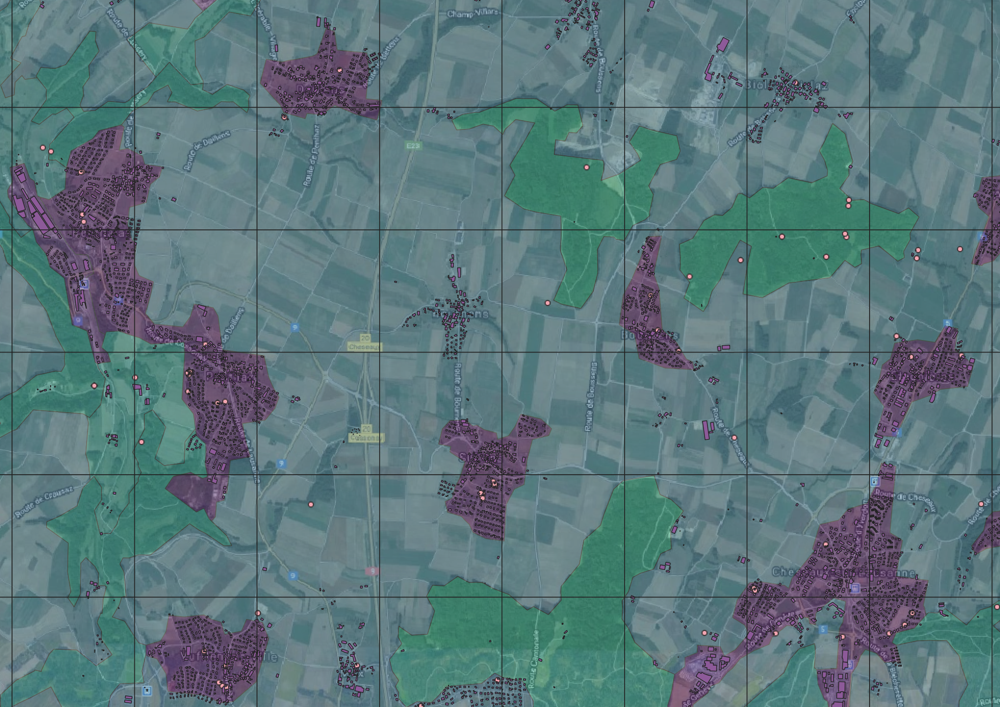

This notebook explores the Opération Fourmis public inventory data and summarises it across a few different potential variables of interest.  


--------

# Overview  
The coordinates associated with the public inventory data are probably approximately accurate overall. My concern is that even relatively minor inaccuracies in the coordinates will cause a lot of misalignment between the local GIS layers and where the ants were actually collected. Even with ideal location recording methods and conditions, the GPS on devices like smartphones typically have a precision of about ± 5m. Before assigning habitat or land use categories to the collections, we need to know how reliable that is as a method, and constrain the questions and analyses accordingly.

```{r setup, include=FALSE, message=FALSE, warning=FALSE}
# libraries, functions, directories
library(tidyverse); library(sf); library(ggsn); library(ggforce); library(janitor)
theme_set(theme_bw() + theme(panel.grid.minor=element_blank())); 
opfo_dir <- "~/Documents/unil/opfo_main/1_opfo/"
gis_dir <- "~/Documents/unil/opfo_main/2_gis/data/VD_21781/"
walk(paste0(opfo_dir, "code/", c("lc_cols", "00_fn"), ".R"), source)
buffer_col <- c('10m'="#b15928", '5m'="#1f78b4", "Point"="grey30", "Vaud"="#238443")

# GIS data
VD_pop <- read_csv(paste0(gis_dir, "VD_2019_popCommune.csv"))
VD_raw <- st_read(paste0(gis_dir, "Vaud_boundaries.shp")) %>%
  filter(!grepl("Lac ", NAME)) %>%
  select(NAME, BFS_NUMMER) %>%
  mutate(pop=VD_pop$Population[match(BFS_NUMMER, VD_pop$Code)],
         area=units::set_units(st_area(.), "km2"), 
         popDens=pop/area)
VD <- st_union(VD_raw)
lc <- st_read(paste0(gis_dir, "lc_21781.shp")) %>% st_set_crs(st_crs(VD)) %>%
  mutate(area=st_area(.))
open_use <- st_read(paste0(gis_dir, "open_landuse_21781.shp")) %>%
  mutate(area=st_area(.))
corine <- st_read(paste0(gis_dir, "corine_VD_21781.shp")) %>%
  mutate(area=st_area(.))
bldg <- st_read(paste0(gis_dir, "buildings_VD_21781.shp"))
roads <- st_read(paste0(gis_dir, "roads_VD_21781.shp")) %>%
  mutate(len=st_length(.))

# ant data
ant <- load_ant_data(clean_spp=F, full_pub=T)
ant$pub <- ant$pub %>%
  mutate(GENUSID=str_split_fixed(SPECIESID, "_", 2)[,1]) %>%
  st_join(VD_raw) 
```

```{r VD_map, echo=FALSE}
ggplot(ant$pub) + geom_sf(data=VD) + 
  geom_sf(shape=1, colour="cadetblue", size=0.5, alpha=0.5) +
  scalebar(data=VD_raw, dist=10, dist_unit="km", transform=F, 
           location="bottomleft", st.size=3, border.size=0.2) + 
  labs(title="Opération Fourmis Public Inventory", x="", y="")
```


--------


# Locational precision  

## `GEOPRECISION`: Coordinate source  
One concern with extracting local variables like habitat, land use, distance from the nearest road, or distance from the nearest building is that that requires a lot of confidence in the latitude and longitude associated with the point locations. The column `GEOPRECISION` indicates whether the location was extrapolated, corrected, or measured (or some combination). 
```{r geoprecision, echo=FALSE}
tabyl(ant$pub$GEOPRECISION) %>% arrange(desc(n)) %>% adorn_pct_formatting() %>%
  knitr::kable(col.names=c("GEOPRECISION", "Tubes", 
                           "Percent", "Percent (non-NA)"),
               caption="Summary of geoprecision categorizations.")
```
The coordinates were mostly measured directly by the collector, and only a small proportion were extrapolated badly. In theory, we could assume that *mesuré*, *extrapolé*, *extrapolé/corrigé*, and *mesuré/corrigé* indicate that the coordinates can be used directly. 

## Digits reported in decimal degrees  
The number of reported digits is an estimate of precision for coordinates reported in decimal degrees, but not for the Swiss coordinate system which reports 6 digits no matter what. For latitude and longitude at the equator, an arc-degree corresponds with about 111km. At a [longitude of 46ºN](https://opendem.info/arc2meters.html), an arc-degree is 76.5km.
```{r prec_kable, echo=FALSE}
knitr::kable(tibble(Dec=c(1:6), 
                    Lat=paste("±", c(5500,555,55.5,5.55,.555,.0555), "m"),
                    Lon=paste("±", c(3825,383,38.3,3.83,.383,.0383), "m")),
             align=c("c", "r"),
             col.names=c("Decimals", "Precision (Lat.)", "Precision (Lon.)"))
```

The reported digits can be used to set a minimum bound if, e.g., only 2 digits are reported, but typically devices will report many digits even if they are not justified. There were `r sum(!is.na(ant$pub$LONGITUDE))` tubes (`r paste0(round(sum(!is.na(ant$pub$LONGITUDE))/nrow(ant$pub)*100, 1), "%")`) reporting the coordinates in decimal degrees, with the rest using the 6-digit Swiss coordinates and no estimate of precision. The decimal degree coordinates include `r sum(!is.na(ant$pub$LONGITUDE) & grepl("extrapolé", ant$pub$GEOPRECISION))` tubes with coordinates extrapolated based on the reported locality. The reliability of the extrapolated coordinates for extracting local variables like habitat or land use type rely on a clear description of the habitat by the collector.
```{r latlon_digits, echo=FALSE}
best_prec.df <- ant$pub %>% st_set_geometry(NULL) %>%
  filter(!is.na(LATITUDE)) %>%
  mutate(Long_prec=nchar(LONGITUDE)-2, # 6.XX or 7.XX
         Lat_prec=nchar(LATITUDE)-3, # 46.XX
         Max_prec=pmin(Long_prec, Lat_prec)) %>% 
  tabyl(Max_prec) 
knitr::kable(best_prec.df %>% adorn_pct_formatting(), 
             col.names=c("Decimals", "Tubes", "Percent"),
             caption="Lat/Lon decimal accuracy (joint coarsest).")
ggplot(best_prec.df, aes(factor(Max_prec), percent)) + 
  geom_hline(yintercept=0, size=0.3, colour="grey30") +
  geom_bar(stat="identity", colour="grey30", size=0.3) + 
  labs(x="Decimal places reported", y="Proportion of lat/lon tubes")
```

Typically, smartphones are accurate under good conditions to about [5m](https://www.gps.gov/systems/gps/performance/accuracy/) in radius, with worse performance around buildings, bridges, trees, etc. It therefore seems likely that coordinates with >5 decimal places are overestimating precision. More importantly, the 5.5% of locations with fewer than 4 should not be taken as-is with a high degree of confidence. Again, this metric isn't possible with the locations recorded with the Swiss coordinate system (2938 tubes: 43%), but it seems reasonable that the distribution of precision would be roughly similar.

## Filtering  
For extracting local conditions based on point locations, it seems reasonable to buffer all points with 5-10m, with the local habitat or land use type assigned as the dominant category within the buffer. The buffer should not affect distance to nearest road, aside from reducing most distances by a uniform amount and reducing points with distances less than the buffer radius to 0m. 

It is also a good idea to remove tubes with `GEOPRECISION == "extrapolé mauvais"` and possibly `"extrapolé (base tube précédent)"`, `"extrapolé (église par défaut)"`, `"extrapolé (gare par défaut)"`, `"extrapolé/corrigé (église par défaut)"` as the uncertainty seems likely to be greater than 5-10m. Lastly, tubes with fewer than 3 decimals for the lat/lon coordinates should also be removed for the same reasons. 

```{r filter_observations}
geo_exclude <- c("extrapolé mauvais", 
                 "extrapolé (base tube précédent)", 
                 "extrapolé (église par défaut)", 
                 "extrapolé (gare par défaut)", 
                 "extrapolé/corrigé (église par défaut)")
pub_filt <- ant$pub %>% 
  filter(!is.na(GEOPRECISION)) %>%
  filter(!GEOPRECISION %in% geo_exclude) %>%
  filter(is.na(LATITUDE) | nchar(LATITUDE) > 5) %>% # Swiss coords | Lat decimals
  filter(is.na(LONGITUDE) | nchar(LONGITUDE) > 4) # Swiss coords | Lon decimals
```


```{r buffer_creation}
pub.5m <- pub_filt %>% st_buffer(dist=5)
pub.10m <- pub_filt %>% st_buffer(dist=10)
```


--------


# Habitat with locational uncertainty

## Habitat datasets  
There are three land cover / land use datasets available:  
- Habitat layer created for the structured sampling  
- [CORINE Land Cover](https://land.copernicus.eu/pan-european/corine-land-cover/clc2018), which has a [broader legend](https://image.discomap.eea.europa.eu/arcgis/rest/services/Corine/CLC2018_WM/MapServer/legend) and is consistent across Europe, but uses a minimum mapping unit of 25 ha (500mx500m)  
- Land use for largely agricultural land in Vaud in 2019  
  
CORINE and the Opération Fourmis dataset have full coverage across Vaud, while the detailed land use dataset is mostly restricted to open canopy areas in the lower elevations (OpFo, CORINE, VD).  

{width="33%"}
{width="33%"}
{width="33%"}  
  
Here is a random area within Vaud showing the differences. The grid is 1km x 1km, with the public inventory tubes shown as the small black points (with 5m and 10m buffers), and building footprints from open street maps. (OpFo, CORINE, VD).  
{width="33%"}
{width="33%"}
{width="33%"}

Zoomed in on the edge of a town (OpFo, CORINE, VD):  
{width="33%"}
{width="33%"}
{width="33%"}

Zoomed in close on a couple of points (OpFo, CORINE, VD):  
{width="33%"}
{width="33%"}
{width="33%"}  

The land use data from the canton describes the reported usage in 2019, generally for open canopy habitats. The usage is quite detailed, with a focus on agriculture. Organic vs. conventional methods are not included. It uses 3-digit codes where the first digit indicates (roughly) *500: crops*, *600: pastures*, *700: permanent agriculture*, *800: other?*, and *900: other?*. This table shows the categories with corresponding area and percent of the total.  
```{r VD_data, echo=FALSE, message=FALSE}
open_use %>% rename(Category=affectatio) %>% st_set_geometry(NULL) %>%
  group_by(Category) %>% 
  summarise(Area=round(units::set_units(sum(area), "km2"),2)) %>%
  ungroup %>% mutate(Percent=round(as.numeric(Area/sum(Area))*100, 1)) %>% 
  arrange(Category)
```

CORINE is often used in the literature, but it probably is not very helpful for us, particularly since we have access to datasets that are more thematically and spatially accurate and precise since the extent is limited to Vaud. It could potentially be useful for defining broadly whether samples were in cities/towns since the legend includes [*Continuous/Discontinuous urban fabric*](https://image.discomap.eea.europa.eu/arcgis/rest/services/Corine/CLC2018_WM/MapServer/legend) (in center column above, purple = discontinuous urban fabric). For the other datasets, the main concern is whether the point locations are reliably precise enough to align them with the layer polygons.  


## Habitat extraction: Points and buffers  
Using the same habitat categories as the structured samples (first column of plots above), we can calculate the habitat for each tube as the point location, the dominant habitat within 5m, and the dominant habitat within 10m.
```{r habitat_calc, eval=FALSE, message=FALSE, warning=FALSE, include=FALSE}
lc_pt.join <- st_join(pub_filt, lc)
lc_5m.join <- st_join(pub.5m, lc)
lc_10m.join <- st_join(pub.10m, lc)
st_write(lc_pt.join %>% select(-SWISSCOORDINATE_X, -SWISSCOORDINATE_Y,
                               -LONGITUDE, -LATITUDE), 
         paste0(gis_dir, "opfo_public_lc_pts.shp"))
st_write(lc_5m.join %>% select(-SWISSCOORDINATE_X, -SWISSCOORDINATE_Y,
                               -LONGITUDE, -LATITUDE), 
         paste0(gis_dir, "opfo_public_lc_5m.shp"))
st_write(lc_10m.join %>% select(-SWISSCOORDINATE_X, -SWISSCOORDINATE_Y,
                               -LONGITUDE, -LATITUDE), 
         paste0(gis_dir, "opfo_public_lc_10m.shp"))
# ESRI format truncates column names
saveRDS(names(lc_pt.join %>% 
                select(-SWISSCOORDINATE_X, -SWISSCOORDINATE_Y,
                       -LONGITUDE, -LATITUDE)),
        paste0(gis_dir, "opfo_public_lc_NAMES.rds"))
```
```{r habitat_load, echo=T, results='hide', message=F}
# Run spatial join one time only because of processing time
# Loading results of st_join(., lc)
lc_pt.join <- st_read(paste0(gis_dir, "opfo_public_lc_pts.shp")) %>%
  setNames(readRDS(paste0(gis_dir, "opfo_public_lc_NAMES.rds")))
lc_5m.join <- st_read(paste0(gis_dir, "opfo_public_lc_5m.shp")) %>%
  setNames(readRDS(paste0(gis_dir, "opfo_public_lc_NAMES.rds")))
lc_10m.join <- st_read(paste0(gis_dir, "opfo_public_lc_10m.shp")) %>%
  setNames(readRDS(paste0(gis_dir, "opfo_public_lc_NAMES.rds")))
```

We can assign the habitat type for each tube as either the habitat at the point location, ignoring uncertainty, or the dominant habitat within the 5m or 10m buffer. Larger buffers will obviously include more habitat categories, and samples collected along roads or edges would most likely be mis-categorized since those habitat types are unlikely to have the greatest coverage within a 5m or 10m radius. Conversely, even slight inaccuracies in the coordinates would result in mis-categorization of these samples based on the point locations. Assigning a habitat to each point with any degree of confidence is not trivial. 
```{r habitat_buffers, echo=FALSE, message=FALSE, warning=FALSE}
lc.df <- pub_filt %>% arrange(TubeNo) %>%
  mutate(lc.pt=(lc_pt.join %>% mutate(area_j=st_area(.)) %>%
                  arrange(TubeNo, desc(area_j)) %>% 
                  group_by(TubeNo) %>%
                  summarise(Cat=first(Categorie)))$Cat,
         lc.5m=(lc_5m.join %>% mutate(area_j=st_area(.)) %>%
                  arrange(TubeNo, desc(area_j)) %>% 
                  group_by(TubeNo) %>%
                  summarise(Cat=first(Categorie)))$Cat,
         lc.10m=(lc_10m.join %>% mutate(area_j=st_area(.)) %>%
                  arrange(TubeNo, desc(area_j)) %>% 
                  group_by(TubeNo) %>%
                  summarise(Cat=first(Categorie)))$Cat,
         n_lc.5m=(lc_5m.join %>% arrange(TubeNo) %>% group_by(TubeNo) %>%
                    summarise(N=n_distinct(Categorie)))$N,
         n_lc.10m=(lc_10m.join %>% arrange(TubeNo) %>% group_by(TubeNo) %>%
                     summarise(N=n_distinct(Categorie)))$N,
         corine.pt=st_join(., corine)$CODE_18,
         corine.5m=st_join(pub.5m %>% arrange(TubeNo), 
                           corine, largest=T)$CODE_18,
         corine.10m=st_join(pub.10m %>% arrange(TubeNo), 
                            corine, largest=T)$CODE_18,
         n_corine.5m=(st_join(pub.5m, corine) %>% arrange(TubeNo) %>% 
                        group_by(TubeNo) %>% summarise(N=n_distinct(CODE_18)))$N,
         n_corine.10m=(st_join(pub.10m, corine) %>% arrange(TubeNo) %>% 
                         group_by(TubeNo) %>% summarise(N=n_distinct(CODE_18)))$N,
         open_use.pt=st_join(., open_use)$affectatio,
         open_use.5m=st_join(pub.5m %>% arrange(TubeNo), 
                             open_use, largest=T)$affectatio,
         open_use.10m=st_join(pub.10m %>% arrange(TubeNo), 
                              open_use, largest=T)$affectatio,
         n_open_use.5m=(st_join(pub.5m, open_use) %>% arrange(TubeNo) %>% 
           group_by(TubeNo) %>% summarise(N=n_distinct(affectatio)))$N,
         n_open_use.10m=(st_join(pub.10m, open_use) %>% arrange(TubeNo) %>% 
           group_by(TubeNo) %>% summarise(N=n_distinct(affectatio)))$N) %>%
  mutate(across(contains("lc"), as.character)) %>%
  mutate(across(contains("corine"), as.character)) %>%
  mutate(across(contains("open_use"), as.character))
```
```{r habitat_buffers_plots, echo=FALSE, message=FALSE, warning=FALSE}
cat.cols <- expand_grid(A=c("corine.", "lc.", "open_use."),
                        B=c("pt", "5m", "10m")) %>% 
  mutate(C=paste0(A, B))
lc.df %>% st_set_geometry(NULL) %>% 
  select(TubeNo, cat.cols$C) %>% 
  pivot_longer(cat.cols$C, names_to="Est", values_to="Cat") %>%
  mutate(Dataset=str_split_fixed(Est, "\\.", 2)[,1], 
         Buffer=str_split_fixed(Est, "\\.", 2)[,2]) %>% select(-Est) %>%
  pivot_wider(names_from="Buffer", values_from="Cat") %>% 
  mutate('Point vs. 5m'=pt==`5m`,
         'Point vs. 10m'=pt==`10m`,
         '5m vs. 10m'=`5m`==`10m`) %>%
  select(Dataset, contains("vs.")) %>% 
  pivot_longer(2:4, names_to="Comparison", values_to="Matching") %>%
  mutate(Dataset=factor(Dataset, levels=c("lc", "corine", "open_use"),
                        labels=c("OpFo", "CORINE", "VD Landuse"))) %>%
  filter(!is.na(Matching)) %>%
  ggplot(aes(Comparison, fill=Matching)) + facet_grid(.~Dataset) +
  geom_hline(yintercept=0, size=0.3, colour="grey30") +
  geom_bar(colour="grey30", size=0.3, position="fill") + 
  scale_y_continuous(labels=scales::percent_format()) + 
  scale_fill_manual(values=c("gray", "#006d2c")) +
  labs(x="", y="Percent of tubes",
       title="Buffers show most difference with points in OpFo") +
  theme(axis.text.x=element_text(angle=270, hjust=0, vjust=0.5))
lc.df %>% st_set_geometry(NULL) %>% 
  select(starts_with("n_")) %>% 
  pivot_longer(everything(), names_to="Est", values_to="N") %>%
  mutate(Dataset=str_remove(str_split_fixed(Est, "\\.", 2)[,1], "n_"), 
         Buffer=str_split_fixed(Est, "\\.", 2)[,2]) %>% select(-Est) %>%
  mutate(Dataset=factor(Dataset, levels=c("lc", "corine", "open_use"),
                        labels=c("OpFo", "CORINE", "VD Landuse"))) %>%
  group_by(Dataset, Buffer, N) %>% summarise(tubes=n()) %>%
  group_by(Dataset, Buffer) %>% mutate(prop=tubes/sum(tubes)) %>%
  ggplot(aes(as.character(N), y=prop, fill=Buffer)) + facet_grid(.~Dataset) +
  geom_hline(yintercept=0, size=0.3, colour="grey30") +
  geom_bar(position="dodge", stat="identity", colour="grey30", size=0.3) +
  scale_y_continuous(labels=scales::percent_format()) + 
  scale_fill_manual(values=buffer_col) +
  labs(x="Number of habitats", y="Percent of tubes", 
       title="Most OpFo buffers include multiple habitats")
```


## `HABITAT`: Comparison of reported and extracted OpFo habitats  
The public samples included a field for habitat, and `r sum(!is.na(pub_filt$HABITAT))` tubes (`r paste0(round(sum(!is.na(pub_filt$HABITAT))/nrow(pub_filt)*100, 1), "%")`) include a free-form entry. However, these were not standardized, and there were `r n_distinct(pub_filt$HABITAT, na.rm=T)` unique responses. They range from extremely precise about where the ant was captured to rather general. Some seem to describe the diameter of the tree where the ant was collected.  
```{r habitat_entries, echo=FALSE}
tabyl(str_sub(lc.df$HABITAT, 1, 60)) %>% select(1,2) %>% 
  setNames(c("HABITAT entries", "count")) %>% as_tibble
```

Many of the habitats used for the OpFo structured samples are unlikely to have direct matches that would allow for unambiguous categorization. Searches for keywords could give an idea of how well the extracted habitat matches the stated habitat for the (mostly) unambiguous keywords.

### Forest  
Forests are generally large habitat polygons, and most `HABITAT` descriptions including the word *forêt* should be describing tubes collected in forest habitat. Edges, borders, and clearings can be filtered out to look at a sort of 'best case' scenario.
```{r habitat_entries_forest, warning=F, message=F}
# Forest is maybe most straightforward, but it will also include edges and clearings
sum(grepl('[f,F]or.t', lc.df$HABITAT))
tabyl(grep('[f,F]or.t', lc.df$HABITAT, value=T)) %>% select(1,2) %>% 
  setNames(c("HABITAT with for*t", "count")) %>% as_tibble %>%
  mutate(`HABITAT with for*t`=str_sub(`HABITAT with for*t`, 1, 60))

# HABITAT including for*t but excluding lisi*re, bord*, and clairi*re
HABITAT_foret <- grep('[f,F]or.t', unique(lc.df$HABITAT), value=T) %>%
  grep('lisi.re', ., value=T, invert=T) %>%
  grep('bord', ., value=T, invert=T) %>%
  grep('clari*re', ., value=T, invert=T)
# Forest habitat categorizations
foret.df <- full_join(filter(lc.df, HABITAT %in% HABITAT_foret) %>% 
                        st_set_geometry(NULL) %>%
                        tabyl(lc.pt) %>% adorn_pct_formatting() %>%
                        select(lc.pt, n, percent) %>% 
                        rename(Categorie=lc.pt, n_pt=n, pct_pt=percent),
                      filter(lc.df, HABITAT %in% HABITAT_foret) %>% 
                        st_set_geometry(NULL) %>%
                        tabyl(lc.5m) %>% adorn_pct_formatting() %>%
                        select(lc.5m, n, percent) %>% 
                        rename(Categorie=lc.5m, n_5m=n, pct_5m=percent),
                      by="Categorie") %>%
  full_join(., 
            filter(lc.df, HABITAT %in% HABITAT_foret) %>% 
              st_set_geometry(NULL) %>%
              tabyl(lc.10m) %>% adorn_pct_formatting() %>%
              select(lc.10m, n, percent) %>% 
              rename(Categorie=lc.10m, n_10m=n, pct_10m=percent), 
            by="Categorie") %>%
  select(Categorie, contains("n_"), contains("pct_"))
knitr::kable(foret.df, 
             caption="Habitat extractions for tubes with HABITAT reported as forest.")
foret.df %>% select(Categorie, contains("n_")) %>% 
  rename(Point=n_pt, `5m`=n_5m, `10m`=n_10m) %>%
  adorn_percentages(denominator="col") %>%
  pivot_longer(2:4, names_to="Buffer", values_to="Prop") %>%
  ggplot(aes(Categorie, Prop, fill=Buffer)) + 
  geom_bar(position="dodge", stat="identity", colour="grey30", size=0.3) +
  scale_y_continuous(labels=scales::percent_format()) + 
  scale_fill_manual(values=buffer_col) +
  labs(x="", y="Percent", 
       title="Forest categorization works best with 5m buffer",
       subtitle="But 25.3% of 'forest' tubes are not forest by 5m location") +
  theme(axis.text.x=element_text(angle=270, hjust=0, vjust=0.5))
```

The 10m buffer ends up including a lot more `Autre`, indicating that those points are near the forest edge even if they aren't specified as such. The high proportion of point locations classified as `transport` could reflect that the ants were collected along a road in the forest, or that the coordinates were recorded after returning to the car.


### Lisière  
The *a priori* expectation is that the point locations should be somewhat better for narrow habitat types like `lisière`. I would also expect poor performance across all methods, since inaccuracy in the point location is likely to move the point outside the habitat polygon, and buffers will include more non-target habitat types.  
```{r habitat_entries_lisiere, warning=F, message=F}
sum(grepl('lisi.re', lc.df$HABITAT))
tabyl(grep('lisi.re', lc.df$HABITAT, value=T)) %>% select(1,2) %>% 
  setNames(c("Edge HABITAT", "count")) %>% as_tibble %>%
  mutate(`Edge HABITAT`=str_sub(`Edge HABITAT`, 1, 60))

# HABITAT including lisi*re or bord*
HABITAT_edge <- unique(grep('lisi.re', unique(lc.df$HABITAT), value=T))
# Edge habitat categorizations
edge.df <- full_join(filter(lc.df, HABITAT %in% HABITAT_edge) %>% 
                        st_set_geometry(NULL) %>%
                        tabyl(lc.pt) %>% adorn_pct_formatting() %>%
                        select(lc.pt, n, percent) %>% 
                        rename(Categorie=lc.pt, n_pt=n, pct_pt=percent),
                      filter(lc.df, HABITAT %in% HABITAT_edge) %>% 
                        st_set_geometry(NULL) %>%
                        tabyl(lc.5m) %>% adorn_pct_formatting() %>%
                        select(lc.5m, n, percent) %>% 
                        rename(Categorie=lc.5m, n_5m=n, pct_5m=percent),
                      by="Categorie") %>%
  full_join(., 
            filter(lc.df, HABITAT %in% HABITAT_edge) %>% 
              st_set_geometry(NULL) %>%
              tabyl(lc.10m) %>% adorn_pct_formatting() %>%
              select(lc.10m, n, percent) %>% 
              rename(Categorie=lc.10m, n_10m=n, pct_10m=percent), 
            by="Categorie") %>%
  select(Categorie, contains("n_"), contains("pct_"))
knitr::kable(edge.df, 
             caption="Habitat extractions for tubes with HABITAT reported as lisière")
edge.df %>% select(Categorie, contains("n_")) %>% 
  rename(Point=n_pt, `5m`=n_5m, `10m`=n_10m) %>%
  adorn_percentages(denominator="col") %>%
  pivot_longer(2:4, names_to="Buffer", values_to="Prop") %>%
  ggplot(aes(Categorie, Prop, fill=Buffer)) + 
  geom_bar(position="dodge", stat="identity", colour="grey30", size=0.3) +
  scale_y_continuous(labels=scales::percent_format()) + 
  scale_fill_manual(values=buffer_col) +
  labs(x="", y="Percent", 
       title="Few 'edge' tubes are lisière based on location") +
  theme(axis.text.x=element_text(angle=270, hjust=0, vjust=0.5))
```

As expected, the point locations capture `lisière` best, but it is still only 16% of the tubes with *lisi.re* in the `HABITAT` description. 


### Roads  
Like for `lisière`, the *a priori* expectation is that the point locations should be better for `transport`, but with relatively poor performance across all methods. There are many descriptions in `HABITAT` that use the word *chemin*, but that's probably used more often for trails rather than actual roads.  
```{r habitat_entries_transport, warning=F, message=F}
sum(grepl('rue($| )|route', lc.df$HABITAT))
tabyl(grep('rue($| )|route', lc.df$HABITAT, value=T)) %>% select(1,2) %>% 
  setNames(c("Road HABITAT", "count")) %>% as_tibble %>%
  mutate(`Road HABITAT`=str_sub(`Road HABITAT`, 1, 60))

# HABITAT including rue or route
HABITAT_road <- unique(grep('rue($| )|route', unique(lc.df$HABITAT), value=T))
# Edge habitat categorizations
road.df <- full_join(filter(lc.df, HABITAT %in% HABITAT_road) %>% 
                        st_set_geometry(NULL) %>%
                        tabyl(lc.pt) %>% adorn_pct_formatting() %>%
                        select(lc.pt, n, percent) %>% 
                        rename(Categorie=lc.pt, n_pt=n, pct_pt=percent),
                      filter(lc.df, HABITAT %in% HABITAT_road) %>% 
                        st_set_geometry(NULL) %>%
                        tabyl(lc.5m) %>% adorn_pct_formatting() %>%
                        select(lc.5m, n, percent) %>% 
                        rename(Categorie=lc.5m, n_5m=n, pct_5m=percent),
                      by="Categorie") %>%
  full_join(., 
            filter(lc.df, HABITAT %in% HABITAT_road) %>% 
              st_set_geometry(NULL) %>%
              tabyl(lc.10m) %>% adorn_pct_formatting() %>%
              select(lc.10m, n, percent) %>% 
              rename(Categorie=lc.10m, n_10m=n, pct_10m=percent), 
            by="Categorie") %>%
  select(Categorie, contains("n_"), contains("pct_"))
knitr::kable(road.df, 
             caption="Habitat extractions for tubes with HABITAT reported as transport")
road.df %>% select(Categorie, contains("n_")) %>% 
  rename(Point=n_pt, `5m`=n_5m, `10m`=n_10m) %>%
  adorn_percentages(denominator="col") %>%
  pivot_longer(2:4, names_to="Buffer", values_to="Prop") %>%
  ggplot(aes(Categorie, Prop, fill=Buffer)) + 
  geom_bar(position="dodge", stat="identity", colour="grey30", size=0.3) +
  scale_y_continuous(labels=scales::percent_format()) + 
  scale_fill_manual(values=buffer_col) +
  labs(x="", y="Percent", 
       title="35.2% of 'road' tubes are transport based on point location") +
  theme(axis.text.x=element_text(angle=270, hjust=0, vjust=0.5))
```

More tubes with `HABITAT` descriptions including *rue* and *route* are classified as `transport` based on point locations, but it is still only about a third. Using the buffers, they are all categorized as the surrounding (non-road) habitats.  


### Zone Construite  
The `ZoneConstruite` category should also be unambiguous. 
```{r habitat_entries_ZC, warning=F, message=F}
# This should be as good of a match as is possible
ZC_keywords <- paste("maison", "appartement", "étage", "balcon", "cuisine", sep="|")
tabyl(grep(ZC_keywords, lc.df$HABITAT, value=T)) %>% select(1,2) %>% 
  setNames(c("ZC HABITAT", "count")) %>% as_tibble %>%
  mutate(`ZC HABITAT`=str_sub(`ZC HABITAT`, 1, 60))

# HABITAT including ZC keywords
HABITAT_ZC <- unique(grep(ZC_keywords, unique(lc.df$HABITAT), value=T))
# ZC habitat categorizations
ZC.df <- full_join(filter(lc.df, HABITAT %in% HABITAT_ZC) %>% 
                        st_set_geometry(NULL) %>%
                        tabyl(lc.pt) %>% adorn_pct_formatting() %>%
                        select(lc.pt, n, percent) %>% 
                        rename(Categorie=lc.pt, n_pt=n, pct_pt=percent),
                      filter(lc.df, HABITAT %in% HABITAT_ZC) %>% 
                        st_set_geometry(NULL) %>%
                        tabyl(lc.5m) %>% adorn_pct_formatting() %>%
                        select(lc.5m, n, percent) %>% 
                        rename(Categorie=lc.5m, n_5m=n, pct_5m=percent),
                      by="Categorie") %>%
  full_join(., 
            filter(lc.df, HABITAT %in% HABITAT_ZC) %>% 
              st_set_geometry(NULL) %>%
              tabyl(lc.10m) %>% adorn_pct_formatting() %>%
              select(lc.10m, n, percent) %>% 
              rename(Categorie=lc.10m, n_10m=n, pct_10m=percent), 
            by="Categorie") %>%
  select(Categorie, contains("n_"), contains("pct_"))
knitr::kable(ZC.df, 
             caption="Habitat extractions for tubes with HABITAT entries containing a ZC keyword")
ZC.df %>% select(Categorie, contains("n_")) %>% 
  rename(Point=n_pt, `5m`=n_5m, `10m`=n_10m) %>%
  adorn_percentages(denominator="col") %>%
  pivot_longer(2:4, names_to="Buffer", values_to="Prop") %>%
  ggplot(aes(Categorie, Prop, fill=Buffer)) + 
  geom_bar(position="dodge", stat="identity", colour="grey30", size=0.3) +
  scale_y_continuous(labels=scales::percent_format()) + 
  scale_fill_manual(values=buffer_col) +
  labs(x="", y="Percent", 
       title="80-90% of 'ZC' tubes are ZC based on location") +
  theme(axis.text.x=element_text(angle=270, hjust=0, vjust=0.5))
```

Generally good correspondence, with perhaps slightly better matching using the 5m buffer: 90.2% instead of 82.1% (points) or 85.4% (10m buffer). 


# Gardens  
## `HABITAT` descriptions and OpFo habitats  
Some of the `HABITAT` descriptions specify that they were collected in gardens. My expectation is that these tubes should almost entirely categorized as `ZoneConstruite`, `Autre`, and `CulturePerm`. 
```{r habitat_entries_garden, warning=F, message=F}
jardin_keywords <- paste("jardin", "potag", sep="|")
sum(grepl(jardin_keywords, lc.df$HABITAT))
tabyl(grep(jardin_keywords, lc.df$HABITAT, value=T)) %>% select(1,2) %>% 
  setNames(c("jardin HABITAT", "count")) %>% as_tibble %>%
  mutate(`jardin HABITAT`=str_sub(`jardin HABITAT`, 1, 60))

# HABITAT including jardin keywords
HABITAT_jardin <- unique(grep(jardin_keywords, unique(lc.df$HABITAT), value=T))
# jardin habitat categorizations
jardin.df <- full_join(filter(lc.df, HABITAT %in% HABITAT_jardin) %>% 
                        st_set_geometry(NULL) %>%
                        tabyl(lc.pt) %>% adorn_pct_formatting() %>%
                        select(lc.pt, n, percent) %>% 
                        rename(Categorie=lc.pt, n_pt=n, pct_pt=percent),
                      filter(lc.df, HABITAT %in% HABITAT_jardin) %>% 
                        st_set_geometry(NULL) %>%
                        tabyl(lc.5m) %>% adorn_pct_formatting() %>%
                        select(lc.5m, n, percent) %>% 
                        rename(Categorie=lc.5m, n_5m=n, pct_5m=percent),
                      by="Categorie") %>%
  full_join(., 
            filter(lc.df, HABITAT %in% HABITAT_jardin) %>% 
              st_set_geometry(NULL) %>%
              tabyl(lc.10m) %>% adorn_pct_formatting() %>%
              select(lc.10m, n, percent) %>% 
              rename(Categorie=lc.10m, n_10m=n, pct_10m=percent), 
            by="Categorie") %>%
  select(Categorie, contains("n_"), contains("pct_"))
knitr::kable(jardin.df, 
             caption="Habitat extractions for tubes with HABITAT entries containing a jardin keyword")
jardin.df %>% select(Categorie, contains("n_")) %>% 
  rename(Point=n_pt, `5m`=n_5m, `10m`=n_10m) %>%
  adorn_percentages(denominator="col") %>%
  pivot_longer(2:4, names_to="Buffer", values_to="Prop") %>%
  ggplot(aes(Categorie, Prop, fill=Buffer)) + 
  geom_bar(position="dodge", stat="identity", colour="grey30", size=0.3) +
  scale_y_continuous(labels=scales::percent_format()) + 
  scale_fill_manual(values=buffer_col) +
  labs(x="", y="Percent", 
       title="82-95% of 'jardin' tubes are ZC/Autre/CP based on location") +
  theme(axis.text.x=element_text(angle=270, hjust=0, vjust=0.5))
```

The buffers both place about 95% of the tubes in `ZoneConstruite`, `Autre`, or `CulturePerm`, compared with 83% of the point locations, which include a higher percentage of `transport`.


## Gardens in and out of CORINE-defined urban areas  
As a first approximation, we could classify points as inside or outside urban areas using the CORINE land cover categories ([1-- indicate human-dominated types](https://image.discomap.eea.europa.eu/arcgis/rest/services/Corine/CLC2018_WM/MapServer/legend)). To categorize tubes as coming from gardens, there are two options: 1) use the `HABITAT` descriptions as above, including all tubes with *jardin* or *potage* in the description, or 2) using the *`r grep("jardin|potag", unique(open_use$affectatio), value=T)`* category in the Vaud land use dataset. Unfortunately, there are no tubes that are categorized as *`r grep("jardin|potag", unique(open_use$affectatio), value=T)`* based on location, regardless of buffering. 
```{r corine_urban, echo=FALSE}
jardin_keywords <- paste("jardin", "potag", sep="|")
HABITAT_jardin <- unique(grep(jardin_keywords, unique(lc.df$HABITAT), value=T))
landuse_jardin <- grep(jardin_keywords, unique(open_use$affectatio), value=T)

lc.df <- lc.df %>% mutate(HAB_jardin=HABITAT %in% HABITAT_jardin,
                          use_jardin.pt=open_use.pt %in% landuse_jardin,
                          use_jardin.5m=open_use.5m %in% landuse_jardin,
                          use_jardin.10m=open_use.10m %in% landuse_jardin,
                          corine_urban.pt=grepl("^1", corine.pt),
                          corine_urban.5m=grepl("^1", corine.5m),
                          corine_urban.10m=grepl("^1", corine.10m),
                          corine_urbanCont.pt=grepl("111", corine.pt),
                          corine_urbanCont.5m=grepl("111", corine.5m),
                          corine_urbanCont.10m=grepl("111", corine.10m))

# jardin HABITAT descriptions by corine category
lc.df %>% st_set_geometry(NULL) %>% tabyl(HAB_jardin, corine_urban.pt) %>%
  knitr::kable(col.names=c("Garden", "Non-Urban", "Urban"), caption="Corine: Point")
lc.df %>% st_set_geometry(NULL) %>% tabyl(HAB_jardin, corine_urban.5m) %>%
  knitr::kable(col.names=c("Garden", "Non-Urban", "Urban"), caption="Corine: 5m")
lc.df %>% st_set_geometry(NULL) %>% tabyl(HAB_jardin, corine_urban.10m) %>%
  knitr::kable(col.names=c("Garden", "Non-Urban", "Urban"), caption="Corine: 10m")
```

There are too few tubes with CORINE classifications of *111 Continuous urban fabric*, which identifies parts of the few largest cities in Vaud. The *112 Discontinuous urban fabric* identifies most (but not all) towns, so the comparison of gardens between cities vs. non-cities would need to be between urban and non-urban categories.  
{width="70%"}

Another possibility would be to categorize communes based on population (that's the smallest unit I've found).  
```{r map_population, echo=FALSE}
A <- ggplot(VD_raw, aes(fill=pop)) + geom_sf(size=0.1) +
  ggtitle("2019 Population") +
  scale_fill_viridis_c("") +
  theme(axis.text=element_blank(),
        legend.position=c(0.25, 0.1), 
        legend.direction="horizontal", 
        legend.key.height=unit(0.2, "cm"),
        legend.key.width=unit(0.35, "cm"),
        legend.text=element_text(size=5))
B <- ggplot(VD_raw, aes(fill=log(pop))) + geom_sf(size=0.1) +
  ggtitle("2019 Population (log)") +
  scale_fill_viridis_c("") +
  theme(axis.text=element_blank(),
        legend.position=c(0.25, 0.1), 
        legend.direction="horizontal", 
        legend.key.height=unit(0.2, "cm"),
        legend.key.width=unit(0.35, "cm"),
        legend.text=element_text(size=5))
C <- ggplot(VD_raw, aes(fill=as.numeric(popDens))) + geom_sf(size=0.1) +
  ggtitle("2019 Population Density (pop/km2)") +
  scale_fill_viridis_c("") +
  theme(axis.text=element_blank(),
        legend.position=c(0.25, 0.1), 
        legend.direction="horizontal", 
        legend.key.height=unit(0.2, "cm"),
        legend.key.width=unit(0.35, "cm"),
        legend.text=element_text(size=5))
ggpubr::ggarrange(A, B, C, nrow=1)
```

For the distribution of population sizes among communes, there isn't much of a clear breakpoint aside from Lausanne. 
```{r hist_population, echo=F}
par(mfrow=c(2,2))
hist(VD_raw$pop, xlab="2019 Population", main="")
hist(log(VD_raw$pop), xlab="2019 Population (log)", main="")
hist(VD_raw$popDens, xlab="2019 density (pop/km2)", main="")
hist(log(as.numeric(VD_raw$popDens)), xlab="2019 log density (log(pop/km2))", main="")
```


## Habitat comparison to Vaud

### OpFo habitats  
Using the habitat types from the structured samples, the public dataset clearly overrepresents `ZoneConstruite` and underrepresents `Autre`.  
```{r OpFo_props, echo=FALSE, message=FALSE}
full_join(lc %>% st_set_geometry(NULL) %>% group_by(Categorie) %>%
            summarise(Area=sum(area)) %>% ungroup %>%
            mutate(Vaud=as.numeric(Area/sum(Area))) %>%
            select(Categorie, Vaud),
          lc.df %>% st_set_geometry(NULL) %>% group_by(lc.pt) %>%
            summarise(N=n()) %>% ungroup %>%
            rename(Categorie=lc.pt) %>%
            mutate(Point=N/sum(N)) %>% select(Categorie, Point), 
          by="Categorie") %>%
  full_join(., lc.df %>% st_set_geometry(NULL) %>% group_by(lc.5m) %>%
            summarise(N=n()) %>% ungroup %>%
            rename(Categorie=lc.5m) %>%
            mutate(`5m`=N/sum(N)) %>% select(Categorie, `5m`),
            by="Categorie") %>%
  full_join(., lc.df %>% st_set_geometry(NULL) %>% group_by(lc.10m) %>%
            summarise(N=n()) %>% ungroup %>%
            rename(Categorie=lc.10m) %>%
            mutate(`10m`=N/sum(N)) %>% select(Categorie, `10m`),
            by="Categorie") %>%
  filter(!is.na(Categorie)) %>%
  pivot_longer(2:5, names_to="Source", values_to="Proportion") %>%
  ggplot(aes(x=Categorie, y=Proportion, fill=Source)) + 
  geom_bar(position="dodge", stat="identity", colour="grey30", size=0.3) +
  scale_y_continuous(labels=scales::percent_format()) + 
  scale_fill_manual(values=buffer_col) +
  labs(x="", y="Percent coverage", title="Opération Fourmis categories") +
  theme(axis.text.x=element_text(angle=270, hjust=0, vjust=0.5))
```

### CORINE  
Similarly with the CORINE dataset, category *112 Discontinuous urban fabric* is very overrepresented, with clear underrepresentation for *211 Non-irrigated arable land* and *312 Coniferous forest*.   
```{r corine_props, echo=FALSE, message=FALSE}
full_join(corine %>% st_set_geometry(NULL) %>% group_by(CODE_18) %>%
            summarise(Area=sum(area)) %>% ungroup %>%
            mutate(Vaud=as.numeric(Area/sum(Area))) %>%
            select(CODE_18, Vaud),
          lc.df %>% st_set_geometry(NULL) %>% group_by(corine.pt) %>%
            summarise(N=n()) %>% ungroup %>%
            rename(CODE_18=corine.pt) %>%
            mutate(Point=N/sum(N)) %>% select(CODE_18, Point), 
          by="CODE_18") %>%
  full_join(., lc.df %>% st_set_geometry(NULL) %>% group_by(corine.5m) %>%
            summarise(N=n()) %>% ungroup %>%
            rename(CODE_18=corine.5m) %>%
            mutate(`5m`=N/sum(N)) %>% select(CODE_18, `5m`),
            by="CODE_18") %>%
  full_join(., lc.df %>% st_set_geometry(NULL) %>% group_by(corine.10m) %>%
            summarise(N=n()) %>% ungroup %>%
            rename(CODE_18=corine.10m) %>%
            mutate(`10m`=N/sum(N)) %>% select(CODE_18, `10m`),
            by="CODE_18") %>%
  filter(!is.na(CODE_18)) %>%
  pivot_longer(2:5, names_to="Source", values_to="Proportion") %>%
  ggplot(aes(x=CODE_18, y=Proportion, fill=Source)) + 
  geom_bar(position="dodge", stat="identity", colour="grey30", size=0.3) +
  scale_y_continuous(labels=scales::percent_format()) + 
  scale_fill_manual(values=buffer_col) +
  labs(x="", y="Percent coverage", title="CORINE categories") +
  theme(axis.text.x=element_text(angle=270, hjust=0, vjust=0.5))
```

For reference:  
```{r CORINE_legend, echo=F, message=F, warning=F}
read_csv(paste0(gis_dir, "corine_legend.csv")) %>% 
  filter(CODE_18 %in% unique(corine$CODE_18)) %>%
  select(Original) %>% rename(Category=Original)
```


### Detailed land use  
For the land use, many crops are underrepresented, while pastures tend to be overrepresented. This is not really surprising given where people would be expected to go to collect ants.  
```{r landuse_props, echo=FALSE, message=FALSE}
full_join(open_use %>% st_set_geometry(NULL) %>% group_by(affectatio) %>%
            summarise(Area=sum(area)) %>% ungroup %>%
            mutate(Vaud=as.numeric(Area/sum(Area))) %>%
            select(affectatio, Vaud),
          lc.df %>% st_set_geometry(NULL) %>% group_by(open_use.pt) %>%
            summarise(N=n()) %>% ungroup %>%
            rename(affectatio=open_use.pt) %>% filter(!is.na(affectatio)) %>%
            mutate(Point=N/sum(N)) %>% select(affectatio, Point), 
          by="affectatio") %>%
  full_join(., lc.df %>% st_set_geometry(NULL) %>% group_by(open_use.5m) %>%
            summarise(N=n()) %>% ungroup %>%
            rename(affectatio=open_use.5m) %>% filter(!is.na(affectatio)) %>%
            mutate(`5m`=N/sum(N)) %>% select(affectatio, `5m`),
            by="affectatio") %>%
  full_join(., lc.df %>% st_set_geometry(NULL) %>% group_by(open_use.10m) %>%
            summarise(N=n()) %>% ungroup %>%
            rename(affectatio=open_use.10m) %>% filter(!is.na(affectatio)) %>%
            mutate(`10m`=N/sum(N)) %>% select(affectatio, `10m`),
            by="affectatio") %>%
  filter(!is.na(affectatio)) %>%
  filter(!(is.na(Point) & is.na(`5m`) & is.na(`10m`))) %>%
  pivot_longer(2:5, names_to="Source", values_to="Proportion") %>%
  ggplot(aes(x=affectatio, y=Proportion, fill=Source)) + 
  geom_bar(position="dodge", stat="identity", colour="grey30", size=0.3) +
  scale_y_continuous(labels=scales::percent_format()) + 
  scale_fill_manual(values=buffer_col) +
  labs(x="", y="Percent coverage", title="Vaud land use categories") +
  theme(axis.text.x=element_text(angle=270, hjust=0, vjust=0.5, size=6),
        legend.title=element_text(size=9),
        legend.text=element_text(size=7),
        legend.key.width=unit(0.5, "cm"),
        legend.key.height=unit(0.5, "cm"), 
        legend.position="bottom")
```


----------

# Proximity to human structures  

For each tube, we can also use the location to calculate the distance to the nearest road and/or building, and potentially what type of road it is. This could be interesting for roads, since the dataset from OpenStreetMaps distinguishes everything from paths to highways. 

```{r road_build_calc, include=FALSE}
lc.df <- lc.df %>%
  mutate(bldg_nearest=st_nearest_feature(., bldg),
         bldg_dist=st_distance(., bldg[bldg_nearest,], by_element=T),
         road_nearest=st_nearest_feature(., roads),
         road_dist=st_distance(., roads[road_nearest,], by_element=T),
         road_nearest_type=roads$fclass[road_nearest])
```


## Roads  
```{r road_map_all, echo=F}
ggplot(VD) + geom_sf() + geom_sf(data=roads, size=0.2, colour="deepskyblue3") +
  theme(axis.text=element_blank(), 
        panel.grid.major=element_blank())
```

There are `r n_distinct(roads$fclass)-2` different identified classes of roads or paths. 
```{r road_types, echo=F, message=F}
roads %>% st_set_geometry(NULL) %>% group_by(fclass) %>%
  summarise(`Total length`=round(sum(units::set_units(len, "km")), 1)) %>% 
  ungroup %>% rename(`Road types`=fclass) %>% select(2,1)
```

Here are maps for each different type of road, reducing them to only the top 15 most extensive categories (total length ≥ 97km).  
```{r road_map_types, echo=F, message=F}
top_15 <- (roads %>% st_set_geometry(NULL) %>% group_by(fclass) %>%
             summarise(Total=round(sum(units::set_units(len, "km")), 1)) %>%
             ungroup %>% arrange(desc(Total)))$fclass[1:15]
ggplot(filter(roads, fclass %in% top_15)) + geom_sf(data=VD, size=0.2) + 
  geom_sf(size=0.2, colour="deepskyblue3") + facet_wrap(~fclass, nrow=3) +
  theme(axis.text=element_blank(), 
        panel.grid.major=element_blank())
```

Buffering points should have minimal influence on distance to the nearest road, since the distance would be reduced by the buffer radius uniformly. The exception would be points nearer to a road than the buffer radius, which would all have a distance of 0m. The type of road nearest to the coordinates should be similarly (mostly) unaffected, though it is possible that a buffer could intersect multiple types of roads. For now, let's ignore that and just use the point locations.
```{r road_types_sampled, echo=F}
ggplot(lc.df, aes(road_nearest_type)) + 
  geom_bar(colour="grey30", size=0.3) + 
  theme(axis.text.x=element_text(angle=270, hjust=0, vjust=0.5)) + 
  labs(x="", y="Count", title="Public inventory points: nearest road types")
```

Many samples were collected near paths, residential roads, and service roads. 

```{r road_distances, echo=F}
cat("Summary of distances to the nearest road (m):\n")
summary(lc.df$road_dist)
cat("\nFurther than 200m:", sum(as.numeric(lc.df$road_dist)>200), 
    "\nFurther than 400m:", sum(as.numeric(lc.df$road_dist)>400))
par(mfrow=c(1,2))
hist(lc.df$road_dist, xlab="Distance to nearest road (m)", main="")
hist(log(as.numeric(lc.df$road_dist)), 
     xlab="Log distance to nearest road (m)", main="")
```

As should be expected, most points are quite close to a road or path. A small number are quite far from any trail in the dataset. 

```{r road_distances_type, echo=F}
ggplot(lc.df, aes(as.numeric(road_dist), y=road_nearest_type)) + 
  ggridges::geom_density_ridges(size=0.2, alpha=0.9, rel_min_height=0.001) + 
  labs(x="Distance to nearest road (m)", y="Nearest road type")
```


## Buildings  
The building dataset doesn't include any usages or descriptions, but consists of building footprints across the whole canton. 
